!!! warning "Gedateerde informatie"

    De onderstaande informatie is gedateerd en hoort geïntegreerd te worden in de rest van de documentatie. Voorlopig wordt de inhoud as-is behouden voor verdere verwerking. Het origineel bestand [kan je hier vinden](https://assets.vlaanderen.be/image/upload/v1637336709/Handleiding_DCAT-AP_VL_v1.0_def_shgpvi.pdf).

# DCAT-AP Vlaanderen

Handleiding voor het gebruik van DCAT-AP VL bij het publiceren van Vlaamse open data

## Context

Het Vlaams Open Data Portaal (VODAP) is één van de Open Data Catalogi in Europa. Omdat open data niet enkel een waardevolle bron zijn voor Vlaamse (her)gebruikers, maar ook voor Europese, heeft de Europese Commissie een applicatieprofiel afgesproken voor Open Data Catalogi van de publieke sector. Aan de hand van dit profiel kan informatie uit Open Data Catalogi op een eenduidige wijze uitgewisseld worden. Dit applicatieprofiel wordt “DCAT Application Profile for data portals in Europe”, afgekort DCAT-AP genoemd. DCAT-AP is gebaseerd op de W3C standaard DCAT - Data Catalogue Vocabulary - en is in overleg met de sector uitgebouwd tot een Europees gedragen specificatie. België en Vlaanderen hebben aan deze specificatie actief meegewerkt (en doen dat nog steeds). Het is het bedoeling om alle uitwisselingen tussen lokale, regionale en federale Open Data Catalogi volgens de DCAT-AP-afspraken te laten verlopen.

DCAT-AP richt zich echter op informatie-uitwisseling op Europees niveau. Hierdoor zijn de afspraken over de uit te wisselen informatie op sommige aspecten eerder generiek en / of niet volgens lokale terminologie. Om aan die lokale noden tegemoet te komen heeft Vlaanderen het DCAT-AP Vlaanderen (verder DCAT-AP VL) applicatieprofiel opgesteld. DCAT-AP VL is een specialisatie (geen uitbreiding) van DCAT-AP.  Met DCAT-AP VL kan een trapsgewijze aggregatie van de inhoud van Vlaamse Open Data Catalogi gerealiseerd worden zodat de informatie beschikbaar op lokaal of Vlaams niveau, zichtbaar en vindbaar wordt op het federale en Europese niveau.

Na goedkeuring door de werkgroep datastandaarden op 13 juni 2019 heeft het stuurorgaan voor het Vlaams Informatie- en ICT-beleid op 3 oktober 2019 DCAT-AP VL erkend als een vrijwillig toe te passen standaard. Om als Vlaamse standaard erkend te worden heeft DCAT-AP VL een OSLO standaardisatie proces doorlopen. Een technische beschrijving van het applicatieprofiel volgens OSLO publicatieafspraken is raadpleegbaar via [deze URL](https://data.vlaanderen.be/doc/applicatieprofiel/DCAT-AP-VL/).

Deze handleiding is bedoeld als introductie tot DCAT-AP VL aangevuld met enkele tips en praktische voorbeelden voor het aanmaken en verifiëren van een DCAT-AP VL bestand.

## Leeswijzer

In dit document geven we eerst een kort overzicht van de DCAT-AP specificatie. Vervolgens bespreken we DCAT-AP VL met bijzondere aandacht voor de bijkomende vereisten die gesteld worden t.o.v. DCAT-AP. Tot slot geven we enkele praktische tips en voorbeelden over het aanmaken en verifiëren van een DCAT-AP VL bestand.

## Terminologie

Een **dataset** is een verzameling van gegevens, die beheerd of gepubliceerd wordt door één agent, en die beschikbaar of downloadbaar is in één of meer formaten. Een dataset is de weerslag van een conceptuele entiteit welke de collectie is van één of meerdere distributies. Elke **distributie** is de werkelijke data van de dataset in een bepaald formaat of een bepaalde aanbiedingsvorm.

**Open Data** zijn gegevens die door de overheid worden verzameld in het kader van haar openbare taak en waar geen of minimale gebruiksbeperkingen op rusten. Bovendien zijn die gegevens elektronisch beschikbaar en wordt gebruik gemaakt van open standaarden. Een **Open Data dataset** is een dataset bestaande uit open data.

Een **Open Data catalogus** is een verzameling van Open Data datasets. Een **Open Data Portaal** is een webapplicatie welke toegang verleent tot een Open Data catalogus, en hierbij tools en middelen aanbiedt om het vinden en het hergebruik van deze datasets te bevorderen en/of te faciliteren.

Het DCAT-AP VL applicatieprofiel verdeelt de klassen en de eigenschappen in 3 verschillende groepen volgens de DCAT-AP 1.2.1 specificatie. Hun betekenis is als volgt:

- **Verplichte klasse**: een ontvanger MOET instanties van deze klasse kunnen verwerken; een leverancier
MOET informatie delen over instanties van deze klasse.
- **Aanbevolen klasse**: een ontvanger MOET instanties van deze klasse kunnen verwerken; een leverancier
BEHOORT informatie over de instanties van deze klasse te delen indien beschikbaar.
- **Optionele klasse**: een ontvanger MOET instanties van deze klasse kunnen verwerken; een leverancier
MAG informatie over instanties van deze klasse delen, maar is niet verplicht dit te doen.
- **Verplichte eigenschap**: een ontvanger MOET de informatie van deze eigenschap kunnen verwerken; een
leverancier MOET informatie over deze eigenschap delen
- **Aanbevolen eigenschap**: een ontvanger MOET de informatie van deze eigenschap kunnen verwerken; een
leverancier BEHOORT informatie over deze eigenschap delen indien beschikbaar
- **Optionele eigenschap**: een ontvanger MOET de informatie van deze eigenschap kunnen verwerken; een
leverancier MAG informatie over deze eigenschap delen maar is niet verplicht

Ter bevordering van de leesbaarheid zullen de vermelde URIs in de tekst afgekort worden met prefix notatie. De gebuikte prefixen zijn:

- adms: http://www.w3.org/ns/adms#
- dcat: http://www.w3.org/ns/dcat#
- dct: http://purl.org/dc/terms/
- foaf: http://xmlns.com/foaf/0.1/
- owl: http://www.w3.org/2002/07/owl#
- rdfs: http://www.w3.org/2000/01/rdf-schema#
- schema: http://schema.org/
- skos: http://www.w3.org/2004/02/skos/core#
- spdx: http://spdx.org/rdf/terms#
- xsd: http://www.w3.org/2001/XMLSchema#
- vcard: http://www.w3.org/2006/vcard/ns#

Daarnaast zullen voor de leesbaarheid ook beter begrijpbare termen worden gebruikt als alternatief voor de URIs. Deze termen worden in cursief gezet en vergezeld met een referentie naar de URI van de entiteit waarover het gaat, e.g., contactpunt (dcat:contactPoint).

## Data Catalogue Vocabulary (DCAT)

De basis van de afspraken met betrekking tot DCAT-AP VL vormt de W3C standaard DCAT (Data Catalogue Vocabulary).

De huidige versie van DCAT-AP, versie 1.2.1, is gebaseerd op het W3C DCAT standaard van 2014. In 2018 is een review gestart door W3C van DCAT. Wanneer DCAT-AP zich aligneert met de nieuwe versie van DCAT zal de DCAT-AP Vlaanderen aangepast worden.

Meer informatie over DCAT is te vinden op:

- W3C 2014 specification: http://www.w3.org/TR/2014/REC-vocab-dcat-20140116/
- W3C DCAT 2.0 specification: https://www.w3.org/TR/vocab-dcat-2/
- W3C revision issue tracking: https://github.com/w3c/dxwg

## Applicatieprofiel (DCAT-AP)

Het DCAT application profile DCAT-AP is een applicatieprofiel van het W3C DCAT vocabularium, bedoeld voor de uitwisseling van catalogus-informatie tussen Data Portalen in Europa. Voor DCAT-AP VL sluiten we aan op de definities zoals gedefinieerd in DCAT-AP versie 1.2.1.

DCAT-AP 1.2.1 is een uitgebreide specificatie met ongeveer 25 klassen en 77 eigenschappen. We zullen in deze handleiding niet elke eigenschap en klasse in detail bespreken, hiervoor verwijzen we naar de specificatie zelf.  Onderstaande samenvatting is zinvol om de specificatie te begrijpen.

De kernklassen van DCAT-AP zijn Catalogus (`dcat:Catalog`), Dataset (`dcat:Dataset`) en Distributie (`dcat:Distribution`). Catalogus en Dataset zijn verplichte klassen, terwijl Distributie aanbevolen is. Voor wat het onderscheid tussen een verplichte of aanbevolen klasse betreft wordt verwezen naar de definities zoals hoger vermeld. De andere DCAT-AP-klassen dienen als ondersteuning van het applicatieprofiel.

Een eigenschap kan verplicht, aanbevolen of optioneel zijn. Verplichte eigenschappen moeten ingevuld zijn voor elke instantie van de klasse en optionele eigenschappen kunnen “naar believen” worden meegegeven. De Europese Commissie heeft gekozen om bepaalde eigenschappen aanbevolen te maken als een motivatie voor de gebruikers van de DCAT-AP specificatie om deze eigenschappen ook op te nemen. Indien de kennis van een aanbevolen eigenschap voorhanden is, behoort men deze te delen. Daarnaast legt de specificatie soms ook bijkomende voorwaarden op aan de waarde die een eigenschap kan / moet bevatten. Dit kan het verplicht gebruik zijn van een codelijst, of de xsd-typering (datatype) van de waarde (b.v. xsd:dateTime). Evenzo kan de kardinaliteit van de waarde soms beperkt worden.

In het algemeen is het zo dat de huidige beperkingen in de specificatie nog veel vrijheidsgraden toelaten. B.v.  Een dataset heeft optioneel één uitgever (slechts 1 maximaal). De uitgever moet een agent (`foaf:Agent`) zijn, en deze moet verplicht een naam (`foaf:name`) hebben (maar kan er meerdere hebben). DCAT-AP legt in dit voorbeeld een minimale structuur op voor een uitgever, welke door een bijkomende specificatie verstrengd kan worden, b.v. door te eisen dat een uitgever ook een website moet hebben.

Onderstaande figuur geeft een beknopt overzicht van DCAT-AP 1.2.1. Elke groene rechthoek stelt een kernklasse voor, welke onderling verbonden zijn door de eigenschappen ‘heeft dataset’ en ‘heeft distributie’. De eigenschappen per klasse zijn opgedeeld in 3 groepen: de oranje zijn verplicht, de donkerblauwe aanbevolen en tenslotte de lichtblauwe optioneel. De figuur toont alle verplichte en aanbevolen eigenschappen, en slechts enkele optionele eigenschappen. Voor de leesbaarheid hebben we de Nederlandstalige labels gebruikt zoals deze ook worden gebruikt in DCAT-AP VL.

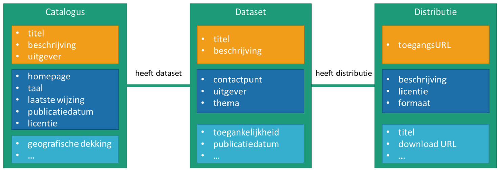

Een _catalogus_ wordt verplicht beschreven door een _titel_, een _beschrijving_ en een _uitgever_. De laatste is verplicht om er zo voor te zorgen dat er een verantwoordelijke voor deze catalogus bekend is. Daarnaast wordt het aanbevolen om informatie te delen over de _webpagina_ waar de catalogus kan worden geëxploreerd, de _taal_ waarin de beschrijvingen van de dataset en distributies worden gedaan, en temporele informatie welke onder andere inzicht geeft in de activiteitsgraad van de catalogus. Ook de _licentie_ waaronder de informatie van de catalogus beschikbaar is, wordt aanbevolen. Als optionele informatie kan men onder meer de _geografische dekking_ specifiëren waarover de datasets in de catalogus een uitspraak doen.

Een _catalogus_ omvat één of meerdere _datasets_ (een lege catalogus is in principe toegelaten maar is natuurlijk weinig zinvol). Een _dataset_ wordt verplicht beschreven met een _titel_ en een _beschrijving_. Daarnaast wordt aangeraden om de gebruiker van de _dataset_ te ondersteunen door hem op eenvoudige wijze in contact te laten komen met een verantwoordelijke van de dataset. Hiervoor worden 2 verwante eigenschappen gebruikt: het _contactpunt_ - de contactgegevens waarlangs de gebruiker kan interageren - en de _uitgever_, de organisatie verantwoordelijk voor de publicatie van de dataset. Om de vindbaarheid in een catalogus te verhogen wordt aangeraden voor elke dataset een _thema_ toe te voegen. Bijkomend kan men onder meer informatie verstrekken over de _temporele aspecten_ van de dataset.

De vorm waarin de data in een dataset beschikbaar is, is beschreven door een distributie van een dataset. Er wordt aanbevolen dat elke dataset minstens een distributie heeft. De toegang tot de distributie wordt verplicht beschreven in een online beschikbaar document (_toegangsURL_). Voor open data, welke per definitie vrij toegankelijk is, is dit meestal een synoniem voor de _download url_. Deze laatste url verwijst naar een downloadbaar bestand of een API (Application Programming Interface). Bijkomend kan de distributie beschreven worden met een _beschrijving_, _titel_ en _formaat_. Tenslotte wordt aangeraden om het gebruik van de distributie wettelijk te kaderen door een _licentie_ mee te geven.

Deze laatste eigenschap is een goed voorbeeld van de afwegingen die gemaakt worden tijdens het opstellen van de DCAT-AP specificatie. Bijna altijd is de licentie voor **alle** _distributies_ van een _dataset_ dezelfde, en kan men argumenteren dat _licentie_ een eigenschap is van een _dataset_. Echter in heel specifieke gevallen kunnen per distributie andere SLA’s en mogelijk ook andere voorwaarden gelden. Daarom is er bij de opmaak van DCAT-AP besloten om licentie een eigenschap te maken van _distributie_. Voor andere eigenschappen (zoals de _temporele_ en _geografische_ dekking) werd eerder omgekeerd besloten.

### DCAT-AP specificatie

Zoals in de inleiding werd aangegeven omvat de DCAT-AP specificatie nog heel wat meer eigenschappen. Meer achtergrondinformatie over de specificatie en alle eigenschappen van DCAT-AP 1.2.1 is te vinden via onderstaande pointers:

- Joinup: https://joinup.ec.europa.eu/solution/dcat-application-profile-data-portals-europe
- DCAT-AP 1.2.1: https://joinup.ec.europa.eu/release/dcat-ap/121
- Github: https://github.com/SEMICeu/DCAT-AP

### DCAT-AP conformiteit

Een Open Data catalogus is conform aan DCAT-AP 1.2.1 als

- de informatie de basisstructuur van catalogus, datasets en distributies volgt;
- er een RDF voorstelling van de catalogus beschikbaar is. Het is niet noodzakelijk dat de gebruikte URIs voldoen aan de Linked Data principes zoals dereferentieerbaarheid;
- de semantiek van de klassen en eigenschappen gevolgd worden en de beschreven eigenschappen en klassen gebruikt worden om de overeenkomstige informatie weer te geven. (Hiermee wordt er bedoeld dat bvb. een _titel_ voor een _dataset_ moet opgenomen worden als waarde van de eigenschap `dct:title` zoals gedefinieerd in de DCAT-AP specificatie, en niet door een andere eigenschap).

Uitbreidingen van de DCAT-AP eigenschappen met bijkomende eigenschappen zijn toegelaten als er een overeenkomstige uitbreiding van de RDF representatie gebeurt.

Bovenstaande regels dwingen dus niet af dat bij het uitwisselen van Open Data catalogus informatie de RDF voorstelling als uitwisselingsformaat moet gebruikt worden. De regels dwingen wel af dat het gebruikte dataformaat eenduidig converteerbaar moet zijn naar de RDF voorstelling en terug.


## DCAT-AP Vlaanderen (DCAT-AP VL)

DCAT-AP Vlaanderen (DCAT-AP VL) is het Vlaamse applicatieprofiel voor Open Data Catalogi. Het is een specialisatie van DCAT-AP voor Open Data catalogi in Vlaanderen.

De ervaring bij het beheren van het Vlaams Open Data Portaal (VODAP) heeft geleerd dat om een kwaliteitsvol Open Data portaal aan te bieden, er best bijkomende eisen worden gesteld aan de dataset-beschrijvingen.  Anderzijds vormt het opstellen en onderhouden van de dataset-beschrijvingen een uitdaging voor vele organisaties. Bij het opstellen van DCAT-AP VL standaard is er dus gezocht naar een balans tussen voldoende detail enerzijds en laagdrempelige aanpak met het oog op een gebruiksvriendelijk Open Data portaal, anderzijds.  Dat heeft er toe geleid dat DCAT-AP VL enkel een minimale verstrenging van DCAT-AP is.

De OSLO methodologie legt op dat er Nederlandstalige terminologie in de specificaties gehanteerd wordt.  Hiervan is ook gebruik gemaakt om de betekenis - waar nodig - scherper te stellen.

- _Datasetcatalogus_ i.p.v. _catalogus_. Hiermee willen we benadrukken dat deze specificatie betrekking heeft op datasets en niet op andere objecttypes, zoals documenten.
- _Uitgever_. De definitie van publisher in de DCAT-AP specificatie laat wat ruimte voor interpretatie. Met deze Nederlandstalige term willen we de definitie vastleggen op de organisatie die de uitgeversrol op zich neemt.

De OSLO modelleringsregels leggen ook op dat de relatie tussen 2 klassen een werkwoord bevat, daarom zijn de relaties hernoemd in het Nederlands naar bijvoorbeeld ‘_heeft dataset_’.


### Bijkomende eisen van DCAT-AP VL t.o.v. DCAT-AP

Onderstaande figuur geeft een overzicht van de bijkomende eisen van DCAT-AP VL t.o.v. DCAT-AP. We bespreken ze elk afzonderlijk.

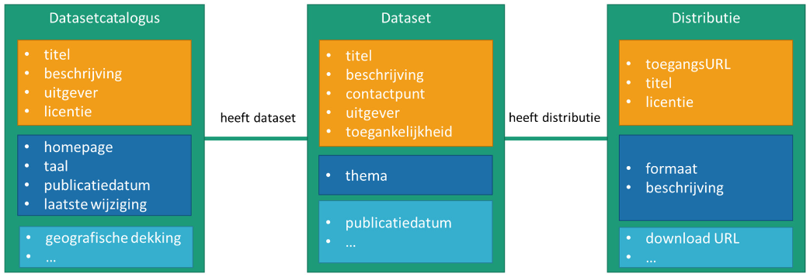

#### Bijkomende eisen voor de klasse Datasetcatalogus

##### Het verplicht aangeven van een licentie

Deze eigenschap stelt de wettelijke bepalingen waaronder de data van de Open Data catalogus kan verwerkt worden. Aangezien de belangrijkste verwerking het ‘harvesten’ (zie paragraaf 7.1) is waarbij Open Data catalogi worden samengevoegd, is kennis van de gebruiksvoorwaarden nodig.

##### Vastleggen van catalogus-licentie
De licentie van de catalogus wordt vastgelegd op `https://data.vlaanderen.be/id/licentie/creative-commons-zero-verklaring/v1.0`. Aangezien we verschillende datasetcatalogi willen aggregeren en het resultaat opnieuw delen, is gebruik van verschillende licenties vaak een struikelblok.

#### Bijkomende eisen voor de klasse Dataset

##### Verplicht aangeven van de _uitgever_

Deze eigenschap verwijst naar de organisatie die verantwoordelijk is voor de publicatie van de dataset. Meestal is de organisatie die instaat voor het verzamelen en samenstellen van de dataset ook de organisatie die instaat voor de verspreiding ervan. Het kan echter voorkomen dat de verspreiding door een andere organisatie uitgevoerd wordt. In dit geval wordt de uitgevende organisatie ingevuld, en is die dus mee verantwoordelijk om de communicatie met de afnemers/gebruikers te coördineren. Door het verplicht opgeven van de uitgever wordt ervoor gezorgd dat er een verantwoordelijke is voor de publicatie welke kan aangesproken worden voor vragen rond hergebruik, beschikbaarheid en toegang.

##### Verplicht aangeven van _contactpunt_

Met de eigenschap _contactpunt_ wordt informatie gedeeld over hoe een gebruiker in contact kan treden met de verantwoordelijke en/of beheerder van de dataset.

##### Verplicht meegeven van een _email adres_ van het contactpunt

Andere gegevens zoals telefoon, website of chatbox zijn optioneel. Een e-mail adres heeft de vorm van een mailto URI volgens de standaard `https://tools.ietf.org/html/rfc6068`.

Waar het verplichten van de uitgever ervoor zorgt dat een organisatie bestaat die de verantwoordelijkheid opneemt voor de publicatie van een dataset, zorgt het verplichten van contactgegevens ervoor dat een organisatie zich ook intern organiseert om deze verantwoordelijkheid op te nemen.

##### Verplicht hebben van minstens 1 _distributie_ voor een dataset

Deze verplichting heeft de bedoeling om te vermijden dat open datasets niet eenvoudig toegankelijk zijn.

##### Aanbevolen codelijst voor _thema_

Het gebruik de Belgische codelijst voor het thema van de een dataset wordt aanbevolen, al dan niet aangevuld met andere codelijsten. Deze codelijst is een (heel beperkte) uitbreiding van de verplichte Europese codelijst.

##### Verplichte waarde voor Toegangsbeperkingen

De waarde om de _toegankelijkheid_ van een dataset aan te duiden is steeds ‘Publiek’ voor Open Data.
Beperkende waarden zoals 'beperkte toegang' of 'niet-publiek' kunnen niet opgenomen als waarde. De waarde
is dus steeds `http://publications.europa.eu/resource/authority/access-right/PUBLIC`.

#### Bijkomende eisen voor de klasse _Distributie_

##### Verplicht aangeven van een _titel_ voor een _distributie_

Deze bijkomende vereiste is er ter ondersteuning van de exploratie door de gebruiker van de Open Data catalogus. Vanuit het perspectief van een machinale verwerking van de catalogus is de meerwaarde beperkt. In een Open Data portaal laat deze titel toe om aan een gebruiker betekenisvolle informatie mee te geven over een _distributie_.

##### Verplicht aangeven van een _licentie_ voor een _distributie_

Een _licentie_ geeft de wettelijke bepalingen weer waaronder de distributie van de dataset kan gebruikt worden.  De keuze van de licentie moet voldoen aan de relevante Vlaamse regelgeving voor hergebruik van overheidsinformatie. In uitvoering van de Europese PSI-richtlijn drukken deze regelingen een voorkeur uit om zo min mogelijk restricties op het (her)gebruik op te leggen.

Er wordt geadviseerd gebruik te maken van de URIs voor de modellicenties voor hergebruik van overheidsinformatie. Zie https://data.vlaanderen.be/doc/licentie/.

Afwijkende licenties zijn toegestaan. Echter in dat geval moeten ze beschreven worden conform de bepalingen van DCAT-AP als een dct:LicenseDocument met een typering van de licentie (dct:type) volgens de ADMS licenceType codelijst (purl.org/adms/licencetype/).

### Gebruiksadviezen

Gebruiksadviezen verduidelijken het gebruik en de invulling van bepaalde DCAT-AP eigenschappen. Door deze te volgen bekomen we een eenvoudigere en eenduidige verwerking van Open Data catalogi tijdens het harvesten (zie paragraaf 7.1) en verhoogt de vindbaarheid van de datasets uit de catalogi.

#### Keyword ‘Vlaamse Open data’

Voeg ‘Vlaamse open data’ als _keyword / tag_ (`dcat:keyword`) toe voor elke dataset die gepubliceerd moet worden op het Vlaamse open data portaal (VODAP). Indien dit keyword ontbreekt zal een dataset beschrijving NIET op het Vlaamse open data portaal worden gepubliceerd. Elke uitgever is verantwoordelijk voor het toevoegen van het keyword opdat publicatie als open data correct verloopt.

#### Algemene gebruiksadviezen

- Zorg voor een stabiele identificator voor elke _dataset_, en waar mogelijk ook voor alle andere vermelde entiteiten. Met dit advies volgen we het DCAT-AP gebruiksadvies i.v.m. identificatoren.
- Voor alle temporele informatie wordt verwacht dat de tijdszone wordt meegegeven.
- Gebruik enkel absolute URLs. Absolute URLs zorgen er voor dat voor alle verwerkingsoperaties van de catalogus de URL identiek blijft en er geen kwaliteitsverlies is voor de gebruiker.
- Indien er voor gekozen is om de _geografische beschrijving_ in de vorm van een geometrie mee te geven wordt aanbevolen het gebruikte Coördinaten Referentie Systeem (CRS) expliciet toe te voegen.
- Beschrijvende informatie zoals titels en beschrijvingen zijn taalafhankelijk. Voorzie voor elke taal slechts één waarde.

#### Specifieke gebruiksadviezen

- Het organisatieregister stelt persistente identificatoren beschikbaar voor publieke organisaties. Gebruik
deze identificatoren bij voorkeur voor de waarde van de eigenschap _uitgever_. Indien de organisatie niet
beschikbaar is in het organisatieregister, beschrijf dan de organisatie in de Open Data catalogus.
- Gebruik steeds een valide absolute URL voor de toegangsURL (en downloadURL). Relatieve URLs in een bestand worden geïnterpreteerd t.o.v. de locatie van het bestand en dat levert in de praktijk ongewenste interpretatiefouten op. Daarom moeten relatieve URLs vermeden worden.

### DCAT-AP VL specificatie

De DCAT-AP VL specificatie is te vinden op https://data.vlaanderen.be/doc/applicatieprofiel/DCAT-AP-VL

Dit document is opgebouwd volgens de OSLO vormregels waarbij voor de gebruikte termen een Nederlandstalige term en definitie wordt voorzien. In de specificatie zijn enkel de verplichte termen opgenomen samen met de termen waarvoor een bijkomende voorwaarde in DCAT-AP VL geldt t.o.v. DCAT-AP 1.2.1. Dit is gedaan om de leesbaarheid van specificatie te behouden.

### DCAT-AP VL conformiteit

Om conform te zijn met het DCAT-AP Vlaanderen applicatieprofiel geldt dat een Open Data catalogus

- MOET conform zijn aan de verplichtingen van DCAT-AP;
- de verstrengingen zoals hierboven beschreven, correct toepast:
    - MOET voor elke klasse steeds de eigenschappen bevatten die als minimum kardinaliteit 1 hebben;
    - MAG NIET meer dan 1 instantie bevatten van eigenschappen die 1 als maximum kardinaliteit hebben;
- MOET de waarden en codelijsten gebruiken zoals opgegeven;
- MAG terminologie (klassen en eigenschappen) gebruiken op een manier die consistent is met haar semantiek (definitie, gebruik, domein en bereik);
- MAG uitgebreid worden met klassen en eigenschappen van andere datamodellen (vocabularia) die niet overlappen met terminologie vermeld in dit document of in DCAT-AP;
- PAST maximaal de algemene en specifieke gebruiksadviezen toe. Enerzijds zorgen deze adviezen voor een uniformere kwaliteit van de dataset-beschrijvingen, anderzijds verduidelijken ze ook enkele afspraken die impliciet zijn in DCAT-AP, en zorgen dus zo voor conformiteit met DCAT-AP.

## DCAT-AP VL toegepast door het Vlaams Open Data Portaal

Het Vlaams Open Data Portaal (VODAP) heeft verschillende rollen, enerzijds het samenvoegen van de
verschillende Open Data Catalogi van Vlaamse en lokale overheidsinstanties tot één coherente catalogus op
Vlaams niveau – dit proces wordt ook ‘harvesten’ genoemd –, anderzijds deze geaggregeerde catalogus
eenvoudig doorzoekbaar maken en bovendien aanbieden aan het federale en Europese (Open) Data portaal.

### Harvesting

Harvesting is een proces dat van nature ontstaat bij gedistribueerde organisaties. In zulke organisaties wordt de
verantwoordelijkheid voor een gelijkaardige taak gedeeld over alle entiteiten van de organisatie. Als men een
geaggregeerd beeld wil bekomen over het geheel, dan moet de informatie van die taak gedeeld, ingezameld en
tenslotte samengevoegd worden.

Om een globaal beeld te krijgen van het aanbod aan Open Data in Vlaanderen, moeten alle dataset- beschrijvingen samengevoegd worden tot één geheel. De uitwisselingsstandaard hiervoor is DCAT-AP VL.  Sommige organisaties zoals stad Gent of Toerisme Vlaanderen hebben een eigen open data portaal en bieden een eigen Open Data catalogus in DCAT-AP VL aan; andere organisaties zetten enkel in op een editoriale omgeving om een DCAT-AP VL compatibele catalogus op te bouwen en laten deze catalogus harvesten door het Vlaams open data portaal (VODAP).

Elke organisatie kan zijn DCAT-AP VL Open Data catalogus registreren in de VODAP harvester en daar het proces opvolgen. Bij het harvesten kunnen er immers technische problemen optreden zoals het niet toegankelijk zijn of onvolledige harvesting van de catalogus. Op basis van de foutmeldingen en in samenwerking met het open data team bij Informatie Vlaanderen kunnen deze problemen worden opgelost. Inhoudelijke problemen zoals een verkeerde beschrijving of een ontbrekende licentie kunnen enkel worden opgelost door een nieuwe versie van de Open Data catalogus aan te bieden.

Om het proces te ondersteunen wordt een DCAT-AP VL validator (http://opendata.vlaanderen.be/validator) beschikbaar gesteld. Elke organisatie kan aan de hand van de validator de beschrijving van de eigen Open Data catalogus testen alvorens te registreren in de VODAP harvester. Hoe je de validator moet gebruiken, wordt in een volgende paragraaf toegelicht.

Tenslotte wordt de geaggregeerde Open Data catalogus met alle aangeboden Vlaamse Open Data beschikbaar gesteld op http://opendata.vlaanderen.be/catalog.rdf . Het is deze catalogus waarmee het federale en Europese open data portaal worden gevoed.

Om de aggregatie van verschillende catalogi op een correcte manier te laten verlopen dienen alle overheden in Vlaanderen enkele afspraken te respecteren. De geharveste Open Data catalogi worden samengevoegd in één overkoepelende Open Data catalogus. Hierbij wordt de informatie over de datasets en distributies integraal overgenomen. Enkel de DCAT-AP VL gekende eigenschappen en klassen worden overgenomen en beschikbaar gesteld in de geaggregeerde Open Data catalogus. Dit betekent dat eigen uitbreidingen van DCAT-AP VL niet zullen doorstromen naar het federale of Europese Open Data portaal.

De Open Data catalogus gepubliceerd door het VODAP heeft als definitie:

| Eigenschap | Waarde |
| --- | --- |
| Titel | Open Data catalogus van Vlaanderen |
| Beschrijving | Deze catalogus bevat de Open Data datasets ontsloten door overheden in Vlaanderen |
| Uitgever | Agentschap Informatie Vlaanderen https://data.vlaanderen.be/doc/organisatie/OVO002949 |
| Licentie | https://data.vlaanderen.be/id/licentie/creative-commons-zero-verklaring/v1.0 |
| Homepagina | https://opendata.vlaanderen.be | 
| Taal | http://publications.europa.eu/resource/authority/language/NLD |
| Geografische dekking | http://publications.europa.eu/resource/authority/atu/BEL_RG_VLS |

### DCAT-AP VL validator

De DCAT-AP VL validator (http://opendata.vlaanderen.be/validator) voert de validatie van een DCAT-AP RDF- bestand uit, waarbij de syntax en de inhoud worden gecontroleerd. Het bestand wordt nagekeken aan de hand van DCAT[^1] (Data Catalog Vocabulary), een specificatie die een metadata-formaat voor datasets beschrijft. Deze specificatie is verder ontwikkeld door de Europese Commissie tot DCAT-AP v1.2.1[^2] voor beschrijvingen van datasets van de overheidssector. Op basis hiervan heeft de Vlaamse overheid een DCAT-AP VL profiel ontwikkeld die voor een aantal velden bijkomende regels/verplichten oplegt.

[^1]: https://www.w3.org/TR/vocab-dcat/
[^2]: https://joinup.ec.europa.eu/release/dcat-ap-v121

Concreet wordt via een HTML formulier een RDF-bestand ingeladen waarna er (op basis van de query taal SPARQL) nagegaan wordt of deze DCAT-AP-VL feed de richtlijnen correct implementeert.

### Technische vereisten DCAT-AP feed

Een DCAT-AP VL feed is een DCAT-AP VL catalogus-bestand dat ophaalbaar is via een URL. Dergelijke DCAT-AP VL feed moet aan volgende technische voorwaarden voldoen:

- De DCAT-AP VL feed geeft een DCAT-AP VL datasetcatalogus in één van de volgende RDF serializaties: RDF/XML, Ntriples of Turtle. Op dit moment wordt JSON-LD nog niet ondersteund.
- De gedownloade informatie moet volledig beschikbaar zijn in één request. Paginatie wordt momenteel nog niet ondersteund, maar indien dit beschikbaar komt zullen de pagineringsafspraken voor generieke Hypermedia API[^3] gevolgd worden.
- De grootte van de gedownloade informatie is maximum 40MB. Deze limiet komt overeen met een paar duizend dataset-beschrijvingen. Dit is voor meeste leveranciers ruim voldoende. Indien dit onvoldoende is, neem dan contact op met het AIV Open Data team.

[^3]: https://github.com/Informatievlaanderen/generieke-hypermedia-api/blob/master/paginering.md

### Validatieproces

Validatie van een DCAT-AP VL feed is een onderdeel van een groter proces waarbij dataset beschrijvingen worden verzameld in het Vlaamse Open Data portaal[^4]. Het onderstaande proces is relevant voor dataset- eigenaars die zelf een datasetcatalogus bijhouden. VODAP (rechts op de figuur) maakt gebruik van een harvest- module die de datasetcatalogus op regelmatige tijdstippen zal ophalen, en deze opladen in de database. De praktijk heeft geleerd dat er behoefte is aan ondersteuning, waarbij de dataset-eigenaar zelfstandig de datasetcatalogus kan evalueren op mogelijke tekortkomingen. Dit gebeurt aan de hand van de DCAT-AP VL Validator. Hiermee kan een dataset-eigenaar de syntax en inhoud van zijn datasetcatalogus controleren vooraleer te publiceren op VODAP. Op basis van de verkregen feedback kan hij de gepaste acties ondernemen.

[^4]: http://opendata.vlaanderen.be/

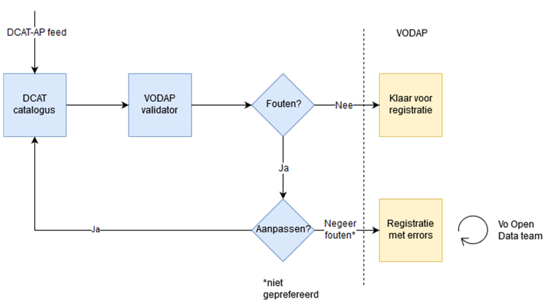

Zoals Figuur 1 aangeeft is er de mogelijkheid om ondanks de aanwezigheid van fouten, het VODAP harvest- proces op te starten. Hoewel dit sterk wordt afgeraden, ligt de eindverantwoordelijkheid hiervoor uitdrukkelijk bij de dataset-eigenaars en kunnen zij hiervan gebruik maken. Het AIV Open Data team zal hooguit op geregelde tijdstippen een algemene kwaliteitsmonitoring uitvoeren. Indien nodig zal er contact opgenomen worden met de dataset-eigenaars.

Als je naar http://opendata.vlaanderen.be/validator surft, kom je op het beginscherm van de standalone validatietool terecht (Figuur 2). In het invoerveld geef je de URL van de DCAT-AP VL feed en kies je de set van regels waartegen je wil valideren. Je bevestigt door op ‘Submit’-knop te drukken.

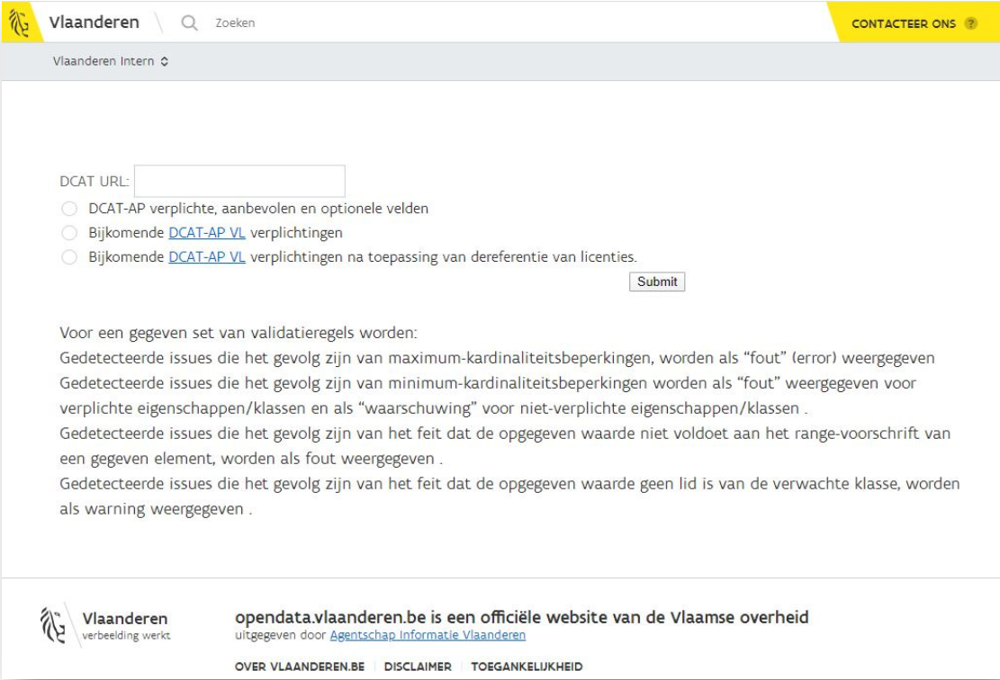

We voorzien verschillende sets van validatieregels zodat men trapsgewijs fouten kan detecteren:

1. DCAT-AP verplichte, aanbevolen en optionele velden
2. Bijkomende DCAT-AP VL verplichtingen
3. Bijkomende DCAT-AP VL verplichtingen na toepassing van dereferentie van licenties.

Regelset 1) omvat alle regels volgens de DCAT-AP specificatie. De DCAT-AP validatieregels zijn opgesteld binnen het ISA programma van de Europese Commissie. De regelset voldoet aan het [DCAT-AP v1.2.1 profiel](https://joinup.ec.europa.eu/asset/dcat_application_profile/asset_release/dcat-ap-v121).

Regelset 2) omvat alle bijkomende verplichtingen zoals aangegeven in de DCAT-AP VL standaard. Een datasetcatalogus die voldoet aan regelset 2) voldoet ook aan de validatieregels voor verplichte DCAT-AP velden.

Regelset 3) is dezelfde verzameling van regels als regelset 2), maar deze wordt toegepast op de data in de gegeven datasetcatalogus, vermeerderd met de data die bekomen wordt door alle licentie-URI’s in de datasetcatalogus te dereferentiëren. Dereferentie is het proces waarbij URI’s worden geresolved om de achterliggende data te bekomen. Door dereferentie toe te laten kan men beknoptere dataset beschrijvingen uitwisselen. In de toekomst willen we de dereferentie functionaliteit uitbreiden naar andere eigenschappen binnen de datasetcatalogus.

Het RDF bestand wordt ingeladen en wordt gecontroleerd op fouten volgens de onderstaande flow. De antwoordtijd is afhankelijk van de grootte van de DCAT-AP VL datasetcatalogus. Zoals men kan zien in figuur 3 gebeurt eerst een syntax controle, gevolgd wordt door een inhoudelijke controle. Het resultaat wordt verwerkt tot een leesbaar document.

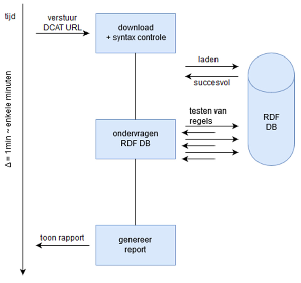

Meer informatie over de validatietool kan men vinden op de GitHub6 van de DCAT-AP VL validator. De validator kan lokaal gedeployed worden als een zelfstandige applicatie.

#### Resultaten

Er zijn drie zaken waarvoor een controle wordt uitgevoerd:

- Syntax controle: is het gedownloade bestand een correct geserialiseerd RDF bestand?
- Inhoudelijke controle:
    - de informatiestructuur voldoet aan de opgelegde vereisten van gebruikte klassen, gebruikte eigenschappen met hun domein en range beperkingen, en
    - de informatiestructuur voldoet aan de opgelegde cardinaliteitsvereisten.  
    
Beide inhoudelijke controles geven aanleiding tot fouten of waarschuwingen. Deze zijn niet blokkerend voor het harvesten van de datasetcatalogus in VODAP.

##### Syntax controle

Indien je na het versturen van de DCAT-AP VL feed het volgend scherm (figuur 4) te zien krijgt, bevindt er zich een fatale fout in de syntax van het bestand waardoor men niet verder kan gaan naar de volgende stap in het validatieproces. Deze fout dient eerst opgelost te worden alvorens verdere validatie kan plaatsvinden.

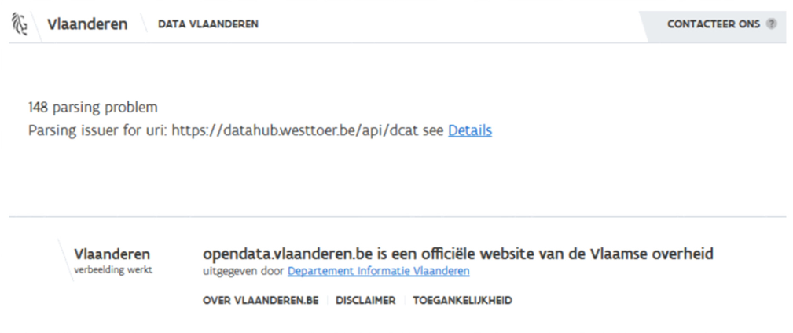

Via de hyperlink onder ‘Details’ vind je een rapport met meer informatie over de syntax fout. Dit rapport eindigt op de laatste succesvol geparsete triple. Dit betekent dat er nog meer syntax fouten aanwezig kunnen zijn en dat de syntax controle herhaald moet worden.

Om parsing problemen op te lossen verwijzen we naar tools zoals [rapper](http://librdf.org/raptor/) op Linux omgevingen of de [W3C RDF validator](https://www.w3.org/RDF/Validator/).

**Voorbeeld (syntax-controle)**

Volgend voorbeeld zal een parsing fout geven omdat het een URI met spaties bevat. Spaties zijn niet toegestaan in URIs.

```
<http://agentschap.be/dataset1> <http://purl.org/dc/terms/> <http://foutieve.url/met een spatie>.
```

##### Inhoudelijke controle

Indien de parsing van het RDF-bestand succesvol uitgevoerd is, verschijnt een pagina met het resultaat van de DCAT-AP VL validatie (zie figuur hieronder). Bovenaan wordt ook de gekozen regelset vermeld.

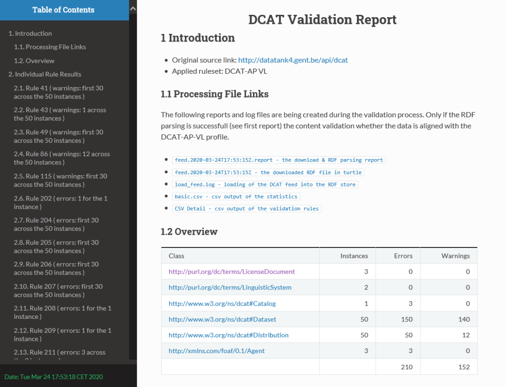

Alle gegenereerde rapporten en log-bestanden zijn beschikbaar voor download via de opgegeven links (zie figuur hieronder).

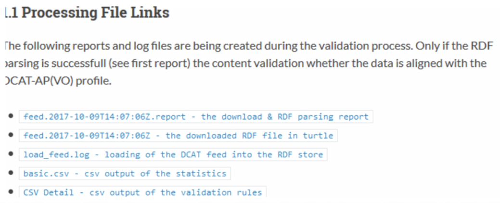

Volgende rapporten zijn beschikbaar:

- Rapport van de download en RDF parsing (`feed.[tijdstip].report`)
- Het DCAT-AP VL RDF-bestand (`feed.[tijdstip]`)
- Logboek met informatie over het inladen in de RDF store (`load_feed.log`)
- Overzicht van aantal fouten en waarschuwingen als csv-bestand (`basic.csv`)
- Detail overzicht van alle gevonden fouten en waarschuwingen (CSV Detail)

Vervolgens zie je een overzicht van de resultaten na het aftoetsen tegen de sets van validatieregels 1), 2) of 3).  Deze informatie is hetzelfde als in de downloadbare file ‘basic.csv’.

Je krijgt een beknopt overzicht van de verschillende DCAT-AP-klassen met het aantal instanties die aanwezig zijn in de ingelezen DCAT-AP VL feed, samen met de mogelijke fouten en waarschuwingen op basis van de gekozen set van validatieregels.

Fouten (errors) duiden problemen aan die best opgelost dienen te worden alvorens men de datasets gaat registreren op het Vlaams Open Data portaal.

Waarschuwingen (warnings) daarentegen zijn suggesties voor verbetering. Het kan geen kwaad om deze verbeteringen door te voeren, maar het is minder noodzakelijk.

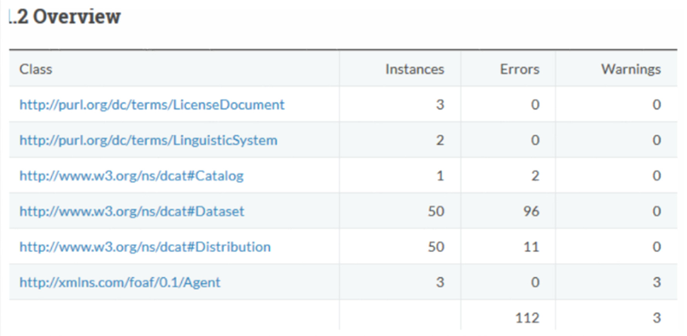

Na dit overzicht volgt dan een lijst met individuele fouten en waarschuwingen t.a.v. de validatieregels van de gekozen regelset. Er worden slechts 30 identieke fouten van dezelfde klasse getoond, er kunnen er dus meer zijn als dat er getoond worden. Een volledig overzicht van de fouten en waarschuwingen is te downloaden bij de beschikbare rapporten (“CSV Detail”). Fouten worden aangeduid in een rood kader. Via de ‘Sparql’ hyperlink wordt meer duiding gegeven over de gevonden fout. Die hyperlink verwijst naar de query waarmee de fout gevonden werd.

### Voorbeelden van fouten en waarschuwingen t.a.v. validatieregels

Hieronder worden voor de meest voorkomende types van fouten en waarschuwingen t.a.v. validatieregels, enkele voorbeelden gegeven. Zoals de voorbeelden tonen, worden de foutboodschappen in het Engels gegeven.  Dat is het gevolg van het overnemen van de DCAT-AP validatieregels van de Europese Commissie. Voor de consistentie van het rapport hebben we dit ook toegepast voor de regels van DCAT-AP VL.

**Gedetecteerde issues die het gevolg zijn van maximum-kardinaliteitsbeperkingen, worden als “fout” (error) weergegeven.**

Wanneer er meer dan het maximaal aantal toegestane waarden voor een eigenschap worden gedetecteerd, wordt dit als een fout getoond:

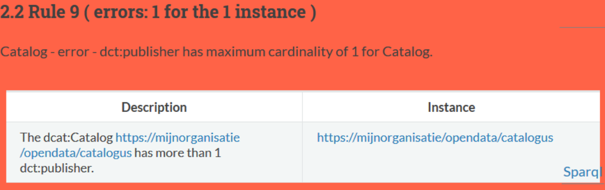

**Gedetecteerde issues die het gevolg zijn van minimum-kardinaliteitsbeperkingen worden als “fout” weergegeven voor verplichte eigenschappen/klassen en als “waarschuwing” voor niet-verplichte eigenschappen/klassen.**

Deze regel komt het best tot uiting in de gevallen van door DCAT-AP aanbevolen elementen (eigenschappen/klassen). Zo beveelt DCAT-AP aan dat een dataset ten minste één distributie heeft. Dit neemt de vorm aan van een minimum-kardinaliteitsbeperking voor `dcat:distribution`.

Zoals het voorbeeld hieronder laat zien geeft dat voor de DCAT-AP regelset aanleiding tot een waarschuwing.

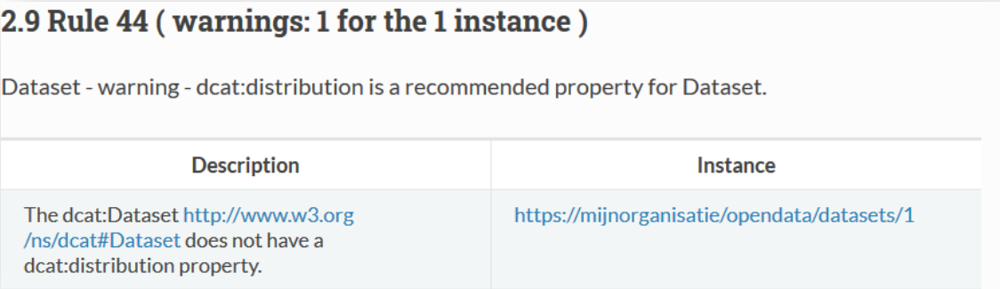

In DCAT-AP VL echter, is ten minste één distributie van een dataset, verstrengt tot een verplichting. Dat resulteert in de volgende foutboodschap:

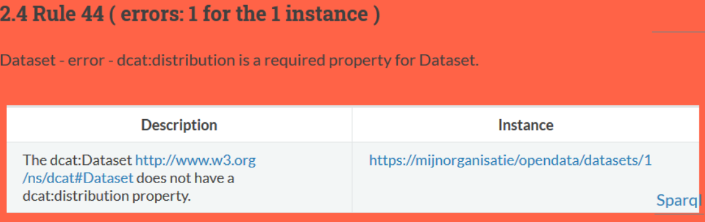

**Gedetecteerde issues die het gevolg zijn van het feit dat de opgegeven waarde niet voldoet aan het range-voorschrift van een gegeven element, worden als fout weergegeven.**

In onderstaand voorbeeld zien we een fout voor een instantie van de klasse _Distributie_ `https://mijnorganisatie/opendata/datasets/1/distributies/api`: de eigenschap `dct:issued`, met als waarde `2019-01-27T15:15:08Z`, moet van het zg. rangetype `literal` zijn, met bovendien als datatype `date` of `dateTime`. In dit geval is het datatype `date` of `dateTime` niet opgegeven, wat aanleiding geeft tot een foutmelding.

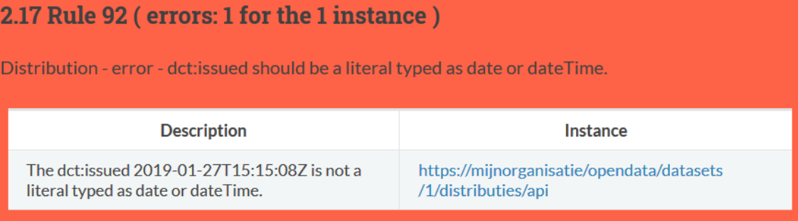

Een ander voorbeeld van de inbreuk op een range-voorschrift is de situatie waarbij de waarde voor de eigenschap toegankelijkheid (`dct:accessRights`) niet voldoet aan de range-vereisten. DCAT-AP VL specifieert met name dat elke dataset in een datasetcatalogus publiek toegankelijk moet zijn, wat moet aangegeven worden als de waarde `http://publications.europa.eu/resource/authority/access-right/PUBLIC` voor `dct:accessRights`.

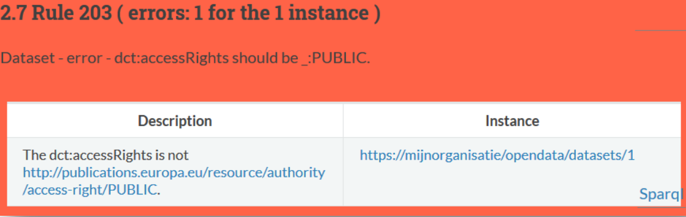

**Gedetecteerde issues die het gevolg zijn van het feit dat de opgegeven waarde geen lid is van de verwachte klasse, worden als warning weergegeven.**

Het voorbeeld hieronder informeert ons dat het contactpunt van de dataset niet gedeclareerd is als een instantie
van de `vcard:Kind` klasse.

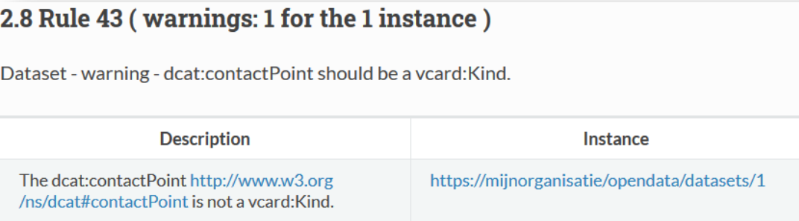

De oorsprong van deze issue is als volgt, beschreven in RDF notatie: 

```ttl
# dit triple is aanwezig ...
<https://mijnorganisatie/opendata/datasets/1> dcat:contactPoint <https://mijnorganisatie/opendata/cp>
# ... zonder dit triple
<https://mijnorganisatie/opendata/cp> rdf:type vcard:Kind .
```
Het ontbreken van deze triple wordt dikwijls verklaard omdat men aanneemt dat deze informatie kan afgeleid worden uit de DCAT-AP specificatie. Daarom worden de gedetecteerde issues in deze situatie niet als fout maar als waarschuwing gegeven, met het doel dat de DCAT-AP VL feed volgens de specificatie wordt gebouwd. Deze issues zullen dus de harvesting van de DCAT-AP VL feed op VODAP niet blokkeren.

**Andere validatieregels**

Naast de voorgaande typische situaties worden nog enkele extra situaties gevalideerd. Deze vinden meestal hun oorsprong in de bijkomende gebruiksadviezen en worden daarom als waarschuwing meegegeven.

Bijvoorbeeld zo is er een bijzondere vorm van de maximum-kardinaliteitsregel, die voorkomt bij taalafhankelijke eigenschappen: het niet is toegestaan om meerdere waarden voor eenzelfde taal te geven. Dus bijvoorbeeld geen twee titels in het Nederlands zoals onderstaande fout aangeeft. Eén titel in het Nederlands en één titel in het Engels is wel correct.

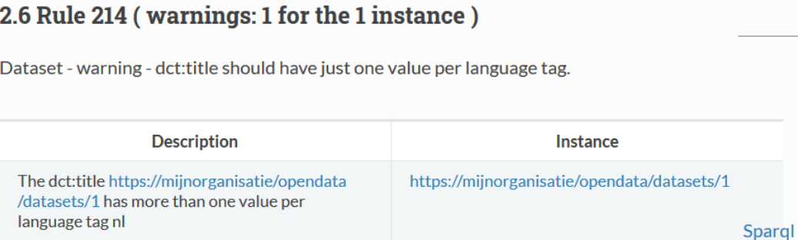

## Aanmaken van een DCAT-AP VL Open Data catalogus

Wij schuiven twee 2 mogelijkheden naar voor om een Open Data datasetcatalogus volgens de DCAT-AP VL specificatie te maken:

- Gebruik maken van de editor van VODAP. Met deze editor kan men de records aanmaken en beheren conform DCAT-AP VL.
- Het zelf opstellen en online aanbieden van een bestand die de DCAT-AP VL specificatie implementeert.

Voor de eerste optie verwijzen we naar de open data handleiding zoals gepubliceerd op https://overheid.vlaanderen.be/open-data-handleiding. In wat volgt bespreken we in meer detail de tweede optie.

Het basis dataformaat van DCAT-AP is een RDF graaf. Er bestaan verschillende serialisaties (tekstuele voorstellingsvormen) van dezelfde graaf. De meest voorkomende serialisaties zijn:

- JSON-LD (JavaScript Object Notation for Linked Data): de meeste recente vorm, als een JSON document.
- N-triples: een tabulaire vorm met 3 kolommen: subject, predicate, object.
- Turtle (Terse RDF Triple Language): een hiërarchische vorm, die gemakkelijker menselijk leesbaar is.
- RDF/XML: de eerste gedefinieerde RDF-serialisatie als een XML document

De serialisaties kunnen naar elkaar geconverteerd worden[^9]. Hieronder geven we twee voorbeelden van dataset catalogi in verschillende serialisaties. Het eerste is een minimaal voorbeeld dat voldoet aan alle vereisten zoals opgelegd door de DCAT-AP VL standaard. Het tweede voorbeeld omvat ook enkele bijkomende eigenschappen die frequent voorkomen.

!!! warning

    Het formaat JSON-LD wordt momenteel nog niet ondersteund door de DCAT-AP VL Validator.

[^9]: Bijvoorbeeld d.m.v. http://www.easyrdf.org/converter

### Voorbeeld 1

#### JSON-LD

```jsonld
{ 
    "@context": "https://raw.githack.com/Informatievlaanderen/OSLO-Generated/test/doc/applicatieprofiel/DCAT-AP VL/standaard/2019-06-13/html/DCAT-AP VL.jsonld",
        "@id": "https://mijnorganisatie/opendata/catalogus",
        "@type": "DatasetCatalogus",
        "heeftLicentie": "https://data.vlaanderen.be/id/licentie/creative-commons-zero- verklaring/v1.0",
        "titel": {"nl": "Open Data Catalogus van Mijn Organisatie"}, "beschrijving": {"nl": "Deze catalogus bevat datasets ontsloten door Mijn Organisatie. "},
        "heeftUitgever": {
            "@type": "Agent",
            "naam": {"nl": "Mijn Organisatie" }
        },
        "heeftDataset": [
        {
            "@id": "https://mijnorganisatie/opendata/datasets/1",
            "@type": "Dataset",
            "titel": { "nl": "zwembadbezoekers" },
            "beschrijving": { "nl": "Deze dataset geeft informatie over het zwembadbezoek." },
            "contactinfo": {
                "@type": "Kind",
                "e-mail": "mailto:opendata@mijnorganisatie.be"
            },
            "heeftUitgever": {
                "@type": "Agent",
                "naam": {"nl": "Mijn Organisatie"}
            },
            "toegankelijkheid": "http://publications.europa.eu/resource/authority/access-
                right/PUBLIC",
            "thema": "http://vocab.belgif.be/auth/datatheme/SOCI",
            "heeftDistributie": [
            {
                "@id": "https://mijnorganisatie/opendata/datasets/1/distributies/csv",
                "@type": "Distributie",
                "titel": { "nl": "Zwembadbezoekers in CSV" },
                "toegangsURL": "https://mijnorganisatie/opendata/datasets/1/distributies/csv",
                "heeftLicentie": "https://data.vlaanderen.be/id/licentie/modellicentie-gratis-hergebruik/v1.0"
            }
            ]
        }
    ]
}
```

#### N-triples

```ntriples
<https://mijnorganisatie/opendata/catalogus> <http://purl.org/dc/terms/description> "Deze catalogus bevat datasets ontsloten door Mijn Organisatie. "@nl .
<https://mijnorganisatie/opendata/catalogus> <http://purl.org/dc/terms/license> <https://data.vlaanderen.be/id/licentie/creative-commons-zero-verklaring/v1.0> .
<https://mijnorganisatie/opendata/catalogus> <http://purl.org/dc/terms/publisher> _:b0 .
<https://mijnorganisatie/opendata/catalogus> <http://purl.org/dc/terms/title> "Open Data Catalogus van Mijn Organisatie"@nl .
<https://mijnorganisatie/opendata/catalogus> <http://www.w3.org/1999/02/22-rdf-syntax-ns#type> <http://www.w3.org/ns/dcat#Catalog> .
<https://mijnorganisatie/opendata/catalogus> <http://www.w3.org/ns/dcat#dataset> <https://mijnorganisatie/opendata/datasets/1> .
<https://mijnorganisatie/opendata/datasets/1/distributies/csv> <http://purl.org/dc/terms/license> <https://data.vlaanderen.be/id/licentie/modellicentie-gratis-hergebruik/v1.0> .
<https://mijnorganisatie/opendata/datasets/1/distributies/csv> <http://purl.org/dc/terms/title> "Zwembadbezoekers in CSV"@nl .
<https://mijnorganisatie/opendata/datasets/1/distributies/csv> <http://www.w3.org/1999/02/22-rdf-syntax-ns#type> <http://www.w3.org/ns/dcat#Distribution> .
<https://mijnorganisatie/opendata/datasets/1/distributies/csv> <http://www.w3.org/ns/dcat#accessURL> <https://mijnorganisatie/opendata/datasets/1/distributies/csv> .
<https://mijnorganisatie/opendata/datasets/1> <http://purl.org/dc/terms/accessRights> <http://publications.europa.eu/resource/authority/access-right/PUBLIC> .
<https://mijnorganisatie/opendata/datasets/1> <http://purl.org/dc/terms/description> "Deze dataset geeft informatie over het zwembadbezoek."@nl .
<https://mijnorganisatie/opendata/datasets/1> <http://purl.org/dc/terms/publisher> _:b1 .
<https://mijnorganisatie/opendata/datasets/1> <http://purl.org/dc/terms/title> "zwembadbezoekers"@nl .
<https://mijnorganisatie/opendata/datasets/1> <http://www.w3.org/1999/02/22-rdf-syntax-ns#type> <http://www.w3.org/ns/dcat#Dataset> .
<https://mijnorganisatie/opendata/datasets/1> <http://www.w3.org/ns/dcat#contactPoint> _:b2 .
<https://mijnorganisatie/opendata/datasets/1> <http://www.w3.org/ns/dcat#distribution> <https://mijnorganisatie/opendata/datasets/1/distributies/csv> .
<https://mijnorganisatie/opendata/datasets/1> <http://www.w3.org/ns/dcat#theme> <http://vocab.belgif.be/auth/datatheme/SOCI> .
_:b0 <http://www.w3.org/1999/02/22-rdf-syntax-ns#type> <http://xmlns.com/foaf/0.1/Agent> .
_:b0 <http://xmlns.com/foaf/0.1/name> "Mijn Organisatie"@nl .
_:b1 <http://www.w3.org/1999/02/22-rdf-syntax-ns#type> <http://xmlns.com/foaf/0.1/Agent> .
_:b1 <http://xmlns.com/foaf/0.1/name> "Mijn Organisatie"@nl .
_:b2 <http://www.w3.org/1999/02/22-rdf-syntax-ns#type> <http://www.w3.org/2006/vcard/ns#Kind> .
_:b2 <http://www.w3.org/2006/vcard/ns#hasEmail> <mailto:opendata@mijnorganisatie.be> .
```

#### Turtle

```turtle
@prefix dc: <http://purl.org/dc/terms/> .
@prefix foaf: <http://xmlns.com/foaf/0.1/> .
@prefix dcat: <http://www.w3.org/ns/dcat#> .
@prefix vcard: <http://www.w3.org/2006/vcard/ns#> .

<https://mijnorganisatie/opendata/catalogus>
    dc:description "Deze catalogus bevat datasets ontsloten door Mijn Organisatie. "@nl ;
    dc:license <https://data.vlaanderen.be/id/licentie/creative-commons-zero-verklaring/v1.0> ;
    dc:publisher [
        a foaf:Agent ;
        foaf:name "Mijn Organisatie"@nl
    ] ;
    dc:title "Open Data Catalogus van Mijn Organisatie"@nl ;
    a dcat:Catalog ;
    dcat:dataset <https://mijnorganisatie/opendata/datasets/1> .

<https://mijnorganisatie/opendata/datasets/1/distributies/csv>
    dc:license <https://data.vlaanderen.be/id/licentie/modellicentie-gratis-hergebruik/v1.0> ;
    dc:title "Zwembadbezoekers in CSV"@nl ;
    a dcat:Distribution ;
    dcat:accessURL <https://mijnorganisatie/opendata/datasets/1/distributies/csv> .

<https://mijnorganisatie/opendata/datasets/1>
    dc:accessRights <http://publications.europa.eu/resource/authority/access-right/PUBLIC> ;
    dc:description "Deze dataset geeft informatie over het zwembadbezoek."@nl ;
    dc:publisher [
    a foaf:Agent ;
        foaf:name "Mijn Organisatie"@nl
    ] ;
    dc:title "zwembadbezoekers"@nl ;
    a dcat:Dataset ;
    dcat:contactPoint [
    a vcard:Kind ;
        vcard:hasEmail <mailto:opendata@mijnorganisatie.be>
    ] ;
    dcat:distribution <https://mijnorganisatie/opendata/datasets/1/distributies/csv> ;
    dcat:theme <http://vocab.belgif.be/auth/datatheme/SOCI> .
```

#### RDF/XML

```xml
<?xml version="1.0" encoding="utf-8" ?>
<rdf:RDF xmlns:rdf="http://www.w3.org/1999/02/22-rdf-syntax-ns#"
         xmlns:dcat="http://www.w3.org/ns/dcat#"
         xmlns:dc="http://purl.org/dc/terms/"
         xmlns:foaf="http://xmlns.com/foaf/0.1/"
         xmlns:vcard="http://www.w3.org/2006/vcard/ns#">
    <dcat:Catalog rdf:about="https://mijnorganisatie/opendata/catalogus">
        <dc:description xml:lang="nl">Deze catalogus bevat datasets ontsloten door Mijn Organisatie.
        </dc:description>
        <dc:license rdf:resource="https://data.vlaanderen.be/id/licentie/creative-commons-zero-verklaring/v1.0"/>
        <dc:publisher>
            <foaf:Agent>
                <foaf:name xml:lang="nl">Mijn Organisatie</foaf:name>
            </foaf:Agent>
        </dc:publisher>
        <dc:title xml:lang="nl">Open Data Catalogus van Mijn Organisatie</dc:title>
        <dcat:dataset>
            <dcat:Dataset rdf:about="https://mijnorganisatie/opendata/datasets/1">
                <dc:accessRights rdf:resource="http://publications.europa.eu/resource/authority/access-right/PUBLIC"/>
                <dc:description xml:lang="nl">Deze dataset geeft informatie over het zwembadbezoek.
                </dc:description>
                <dc:publisher>
                    <foaf:Agent>
                        <foaf:name xml:lang="nl">Mijn Organisatie</foaf:name>
                    </foaf:Agent>
                </dc:publisher>
                <dc:title xml:lang="nl">zwembadbezoekers</dc:title>
                <dcat:contactPoint>
                    <vcard:Kind>
                        <vcard:hasEmail rdf:resource="mailto:opendata@mijnorganisatie.be"/>
                    </vcard:Kind>
                </dcat:contactPoint>
                <dcat:distribution rdf:resource="https://mijnorganisatie/opendata/datasets/1/distributies/csv"/>
                <dcat:theme rdf:resource="http://vocab.belgif.be/auth/datatheme/SOCI"/>
            </dcat:Dataset>
        </dcat:dataset>
    </dcat:Catalog>
    <dcat:Distribution rdf:about="https://mijnorganisatie/opendata/datasets/1/distributies/csv">
        <dc:license rdf:resource="https://data.vlaanderen.be/id/licentie/modellicentie-gratis-hergebruik/v1.0"/>
        <dc:title xml:lang="nl">Zwembadbezoekers in CSV</dc:title>
        <dcat:accessURL rdf:resource="https://mijnorganisatie/opendata/datasets/1/distributies/csv"/>
    </dcat:Distribution>
</rdf:RDF>
```

### Voorbeeld 2

```jsonld
{
  "@context": [
    "https://otl-test.data.vlaanderen.be/doc/applicatieprofiel/DCATAP-VL /standaard/2019-06-13/html/DCATAP-VL.jsonld",
    {
      "beschrijving": {
        "@id": "http://purl.org/dc/terms/description",
        "@container": [
          "@language",
          "@set"
        ],
        "@type": "http://www.w3.org/1999/02/22-rdf-syntax-ns#langString"
      },
      "titel": {
        "@container": [
          "@language",
          "@set"
        ],
        "@id": "http://purl.org/dc/terms/title",
        "@type": "http://www.w3.org/1999/02/22-rdf-syntax-ns#langString"
      },
      "heeftUitgever": {
        "@id": "http://purl.org/dc/terms/publisher",
        "@type": "@id"
      },
      "naam": {
        "@container": [
          "@language",
          "@set"
        ],
        "@id": "http://xmlns.com/foaf/0.1/name",
        "@type": "http://www.w3.org/1999/02/22-rdf-syntax-ns#langString"
      },
      "heeftLicentie": {
        "@id": "http://purl.org/dc/terms/license",
        "@type": "@id"
      },
      "toegankelijkheid": {
        "@id": "http://purl.org/dc/terms/accessRights",
        "@type": "@id"
      },
      "toegangsURL": {
        "@id": "http://www.w3.org/ns/dcat#accessURL",
        "@type": "@id"
      },
      "thema": {
        "@container": "@set",
        "@id": "http://www.w3.org/ns/dcat#theme",
        "@type": "@id"
      },
      "e-mail": {
        "@id": "http://www.w3.org/2006/vcard/ns#hasEmail",
        "@type": "@id"
      },
      "vcard": "http://www.w3.org/2006/vcard/ns#",
      "locn": "http://www.w3.org/ns/locn#",
      "keyword": {
        "@id": "http://www.w3.org/ns/dcat#keyword",
        "@type": "http://www.w3.org/2000/01/rdf-schema#string"
      },
      "startDate": {
        "@id": "http://schema.org/startDate",
        "@type": "http://www.w3.org/2001/XMLSchema#date"
      },
      "endDate": {
        "@id": "http://schema.org/endDate",
        "@type": "http://www.w3.org/2001/XMLSchema#date"
      },
      "temporal": {
        "@id": "http://purl.org/dc/terms/temporal",
        "@type": "http://purl.org/dc/terms/PeriodOfTime",
        "@container": "@set"
      },
      "spatial": {
        "@id": "http://purl.org/dc/terms/spatial",
        "@type": "@id",
        "@container": "@set"
      }
    }
  ],
  "@id": "https://mijnorganisatie/opendata/catalogus",
  "@type": "DatasetCatalogus",
  "heeftLicentie": "https://data.vlaanderen.be/id/licentie/creative-commons-zero-verklaring/v1.0",
  "titel": {
    "nl": "Open Data Catalogus van Mijn Organisatie"
  },
  "beschrijving": {
    "nl": "Deze catalogus bevat datasets ontsloten door Mijn Organisatie. "
  },
  "heeftUitgever": {
    "@type": "Agent",
    "naam": {
      "nl": "Mijn Organisatie"
    },
    "type": "http://purl.org/adms/publishertype/LocalAuthority"
  },
  "homepage": "https://mijnorganisatie/index.html",
  "language": "http://publications.europa.eu/resource/authority/language/NLD",
  "issued": "2016-12-10T12:54:04Z",
  "modified": "2019-02-27T15:15:08Z",
  "heeftDataset": [
    {
      "@id": "https://mijnorganisatie/opendata/datasets/1",
      "@type": "Dataset",
      "identifier": [
        "d27f4899-13e2-4e56-8702-29b06120f80d",
        "https://mijnorganisatie/opendata/datasets/1"
      ],
      "titel": {
        "nl": "zwembadbezoekers"
      },
      "beschrijving": {
        "nl": "Deze dataset geeft informatie over het zwembadbezoek."
      },
      "contactinfo": {
        "@type": "Organization",
        "e-mail": "mailto:opendata@mijnorganisatie.be",
        "vcard:hasURL": "http://mijnorganisatie.org/",
        "vcard:fn": "Mijn Toffe Organisatie",
        "vcard:organization-name": "Mijn Toffe Organisatie"
      },
      "heeftUitgever": {
        "@type": "Agent",
        "naam": {
          "nl": "Mijn Organisatie"
        }
      },
      "keyword": [
        "zwembad",
        "statistiek",
        "bezoekers"
      ],
      "language": "http://publications.europa.eu/resource/authority/language/NLD",
      "toegankelijkheid": "http://publications.europa.eu/resource/authority/access-right/PUBLIC",
      "thema": [
        "http://vocab.belgif.be/auth/datatheme/SOCI",
        "https://www.eionet.europa.eu/gemet/en/theme/29"
      ],
      "temporal": {
        "startDate": "2018-01-01",
        "endDate": "2019-01-01"
      },
      "versionInfo": "versie/1.0.1",
      "spatial": {
        "@id": "http://mir.geopunt.be/cl/Geopunt/VlaamseAdminRegios/Vlaanderen",
        "@type": "Location",
        "locn:geometry": {
          "@value": "POLYGON ((5.92 50.67,5.92 51.51,2.53 51.51,2.53 50.67,5.92 50.67))",
          "@type": "http://www.opengis.net/ont/geosparql#wktLiteral"
        }
      },
      "heeftDistributie": [
        {
          "@id": "https://mijnorganisatie/opendata/datasets/1/distributies/csv",
          "@type": "Distributie",
          "titel": {
            "nl": "Zwembadbezoekers in CSV"
          },
          "toegangsURL": "https://mijnorganisatie/opendata/datasets/1/distributies/csv",
          "format": "http://publications.europa.eu/resource/authority/file-type/CSV",
          "heeftLicentie": "https://data.vlaanderen.be/id/licentie/modellicentie-gratis-hergebruik/v1.0"
        },
        {
          "@id": "https://mijnorganisatie/opendata/datasets/1/distributies/api",
          "@type": "Distributie",
          "titel": {
            "nl": "Zwembadbezoekers API"
          },
          "beschrijving": {
            "nl": "een api waarmee statitische data wordt ontsloten"
          },
          "issued": "2019-01-27T15:15:08Z",
          "modified": "2019-02-27T15:15:08Z",
          "mediatype": "https://www.iana.org/assignments/media-types/application/json",
          "toegangsURL": "https://mijnorganisatie/opendata/datasets/1/distributies/api",
          "downloadURL": "https://mijnorganisatie/opendata/datasets/1/distributies/api",
          "heeftLicentie": "https://data.vlaanderen.be/id/licentie/modellicentie-gratis-hergebruik/v1.0"
        }
      ]
    }
  ]
}
```

#### N-triples

```ntriples
_:b0 <http://purl.org/dc/terms/type> <http://purl.org/adms/publishertype/LocalAuthority> .
_:b0 <http://www.w3.org/1999/02/22-rdf-syntax-ns#type> <http://xmlns.com/foaf/0.1/Agent> .
_:b0 <http://xmlns.com/foaf/0.1/name> "Mijn Organisatie"@nl .
<https://mijnorganisatie/opendata/catalogus> <http://purl.org/dc/terms/description> "Deze
catalogus bevat datasets ontsloten door Mijn Organisatie. "@nl .
<https://mijnorganisatie/opendata/catalogus> <http://purl.org/dc/terms/issued> "2016-12-
10T12:54:04Z" .
<https://mijnorganisatie/opendata/catalogus> <http://purl.org/dc/terms/language>
<http://publications.europa.eu/resource/authority/language/NLD> .
<https://mijnorganisatie/opendata/catalogus> <http://purl.org/dc/terms/license>
<https://data.vlaanderen.be/id/licentie/creative-commons-zero-verklaring/v1.0> .
<https://mijnorganisatie/opendata/catalogus> <http://purl.org/dc/terms/modified> "2019-02-
27T15:15:08Z" .
<https://mijnorganisatie/opendata/catalogus> <http://purl.org/dc/terms/publisher> _:b0 .
<https://mijnorganisatie/opendata/catalogus> <http://purl.org/dc/terms/title> "Open Data
Catalogus van Mijn Organisatie"@nl .
<https://mijnorganisatie/opendata/catalogus> <http://www.w3.org/1999/02/22-rdf-syntax-ns#type>
<http://www.w3.org/ns/dcat#Catalog> .
<https://mijnorganisatie/opendata/catalogus> <http://www.w3.org/ns/dcat#dataset>
<https://mijnorganisatie/opendata/datasets/1> .
<https://mijnorganisatie/opendata/catalogus> <http://xmlns.com/foaf/0.1/homepage>
<https://mijnorganisatie/index.html> .
_:b1 <http://www.w3.org/1999/02/22-rdf-syntax-ns#type> <http://xmlns.com/foaf/0.1/Agent> .
_:b1 <http://xmlns.com/foaf/0.1/name> "Mijn Organisatie"@nl .
_:b2 <http://schema.org/endDate> "2019-01-01"^^<http://www.w3.org/2001/XMLSchema#date> .
_:b2 <http://schema.org/startDate> "2018-01-01"^^<http://www.w3.org/2001/XMLSchema#date> .
_:b3 <http://www.w3.org/1999/02/22-rdf-syntax-ns#type> <https://json-
ld.org/playground/Organization> .
_:b3 <http://www.w3.org/2006/vcard/ns#fn> "Mijn Toffe Organisatie" .
_:b3 <http://www.w3.org/2006/vcard/ns#hasEmail> <mailto:opendata@mijnorganisatie.be> .
_:b3 <http://www.w3.org/2006/vcard/ns#hasURL> "http://mijnorganisatie.org/" .
_:b3 <http://www.w3.org/2006/vcard/ns#organization-name> "Mijn Toffe Organisatie" .
<http://mir.geopunt.be/cl/Geopunt/VlaamseAdminRegios/Vlaanderen> <http://www.w3.org/1999/02/22-
rdf-syntax-ns#type> <http://purl.org/dc/terms/Location> .
<http://mir.geopunt.be/cl/Geopunt/VlaamseAdminRegios/Vlaanderen>
<http://www.w3.org/ns/locn#geometry> "POLYGON ((5.92 50.67,5.92 51.51,2.53 51.51,2.53 50.67,5.92
50.67))"^^<http://www.opengis.net/ont/geosparql#wktLiteral> .
<https://mijnorganisatie/opendata/datasets/1/distributies/api>
<http://purl.org/dc/terms/description> "een api waarmee statitische data wordt ontsloten"@nl .
<https://mijnorganisatie/opendata/datasets/1/distributies/api> <http://purl.org/dc/terms/issued>
"2019-01-27T15:15:08Z" .
<https://mijnorganisatie/opendata/datasets/1/distributies/api>
<http://purl.org/dc/terms/license> <https://data.vlaanderen.be/id/licentie/modellicentie-gratis-
hergebruik/v1.0> .
<https://mijnorganisatie/opendata/datasets/1/distributies/api>
<http://purl.org/dc/terms/modified> "2019-02-27T15:15:08Z" .
<https://mijnorganisatie/opendata/datasets/1/distributies/api> <http://purl.org/dc/terms/title>
"Zwembadbezoekers API"@nl .
<https://mijnorganisatie/opendata/datasets/1/distributies/api> <http://www.w3.org/1999/02/22-
rdf-syntax-ns#type> <http://www.w3.org/ns/dcat#Distribution> .
<https://mijnorganisatie/opendata/datasets/1/distributies/api>
<http://www.w3.org/ns/dcat#accessURL>
<https://mijnorganisatie/opendata/datasets/1/distributies/api> .
<https://mijnorganisatie/opendata/datasets/1/distributies/api>
<http://www.w3.org/ns/dcat#downloadURL>
<https://mijnorganisatie/opendata/datasets/1/distributies/api> .
<https://mijnorganisatie/opendata/datasets/1/distributies/csv> <http://purl.org/dc/terms/format>
<http://publications.europa.eu/resource/authority/file-type/CSV> .
<https://mijnorganisatie/opendata/datasets/1/distributies/csv>
<http://purl.org/dc/terms/license> <https://data.vlaanderen.be/id/licentie/modellicentie-gratis-
hergebruik/v1.0> .
<https://mijnorganisatie/opendata/datasets/1/distributies/csv> <http://purl.org/dc/terms/title>
"Zwembadbezoekers in CSV"@nl .
<https://mijnorganisatie/opendata/datasets/1/distributies/csv> <http://www.w3.org/1999/02/22-
rdf-syntax-ns#type> <http://www.w3.org/ns/dcat#Distribution> .
<https://mijnorganisatie/opendata/datasets/1/distributies/csv>
<http://www.w3.org/ns/dcat#accessURL>
<https://mijnorganisatie/opendata/datasets/1/distributies/csv> .
<https://mijnorganisatie/opendata/datasets/1> <http://purl.org/dc/terms/accessRights>
<http://publications.europa.eu/resource/authority/access-right/PUBLIC> .
<https://mijnorganisatie/opendata/datasets/1> <http://purl.org/dc/terms/description> "Deze
dataset geeft informatie over het zwembadbezoek."@nl .
<https://mijnorganisatie/opendata/datasets/1> <http://purl.org/dc/terms/identifier> "d27f4899-
13e2-4e56-8702-29b06120f80d" .
<https://mijnorganisatie/opendata/datasets/1> <http://purl.org/dc/terms/identifier>
"https://mijnorganisatie/opendata/datasets/1" .
<https://mijnorganisatie/opendata/datasets/1> <http://purl.org/dc/terms/language>
<http://publications.europa.eu/resource/authority/language/NLD> .
<https://mijnorganisatie/opendata/datasets/1> <http://purl.org/dc/terms/publisher> _:b1 .
<https://mijnorganisatie/opendata/datasets/1> <http://purl.org/dc/terms/spatial>
<http://mir.geopunt.be/cl/Geopunt/VlaamseAdminRegios/Vlaanderen> .
<https://mijnorganisatie/opendata/datasets/1> <http://purl.org/dc/terms/temporal> _:b2 .
<https://mijnorganisatie/opendata/datasets/1> <http://purl.org/dc/terms/title>
"zwembadbezoekers"@nl .
<https://mijnorganisatie/opendata/datasets/1> <http://www.w3.org/1999/02/22-rdf-syntax-ns#type>
<http://www.w3.org/ns/dcat#Dataset> .
<https://mijnorganisatie/opendata/datasets/1> <http://www.w3.org/2002/07/owl#versionInfo>
"versie/1.0.1" .
<https://mijnorganisatie/opendata/datasets/1> <http://www.w3.org/ns/dcat#contactPoint> _:b3 .
<https://mijnorganisatie/opendata/datasets/1> <http://www.w3.org/ns/dcat#distribution>
<https://mijnorganisatie/opendata/datasets/1/distributies/api> .
<https://mijnorganisatie/opendata/datasets/1> <http://www.w3.org/ns/dcat#distribution>
<https://mijnorganisatie/opendata/datasets/1/distributies/csv> .
<https://mijnorganisatie/opendata/datasets/1> <http://www.w3.org/ns/dcat#keyword>
"bezoekers"^^<http://www.w3.org/2000/01/rdf-schema#string> .
<https://mijnorganisatie/opendata/datasets/1> <http://www.w3.org/ns/dcat#keyword>
"statistiek"^^<http://www.w3.org/2000/01/rdf-schema#string> .
<https://mijnorganisatie/opendata/datasets/1> <http://www.w3.org/ns/dcat#keyword>
"zwembad"^^<http://www.w3.org/2000/01/rdf-schema#string> .
<https://mijnorganisatie/opendata/datasets/1> <http://www.w3.org/ns/dcat#theme>
<https://www.eionet.europa.eu/gemet/en/theme/29> .
<https://mijnorganisatie/opendata/datasets/1> <http://www.w3.org/ns/dcat#theme>
<http://vocab.belgif.be/auth/datatheme/SOCI> .
```

#### Turtle

```turtle
@prefix dc: <http://purl.org/dc/terms/> .
@prefix ns0: <http://www.w3.org/ns/locn#> .
@prefix ns1: <http://www.opengis.net/ont/geosparql#> .
@prefix foaf: <http://xmlns.com/foaf/0.1/> .
@prefix dcat: <http://www.w3.org/ns/dcat#> .
@prefix schema: <http://schema.org/> .
@prefix xsd: <http://www.w3.org/2001/XMLSchema#> .
@prefix owl: <http://www.w3.org/2002/07/owl#> .
@prefix vcard: <http://www.w3.org/2006/vcard/ns#> .
@prefix rdfs: <http://www.w3.org/2000/01/rdf-schema#> .
<http://mir.geopunt.be/cl/Geopunt/VlaamseAdminRegios/Vlaanderen>
a dc:Location ;
ns0:geometry "POLYGON ((5.92 50.67,5.92 51.51,2.53 51.51,2.53 50.67,5.92
50.67))"^^ns1:wktLiteral .
<https://mijnorganisatie/opendata/catalogus>
dc:description "Deze catalogus bevat datasets ontsloten door Mijn Organisatie. "@nl ;
dc:issued "2016-12-10T12:54:04Z" ;
dc:language <http://publications.europa.eu/resource/authority/language/NLD> ;
dc:license <https://data.vlaanderen.be/id/licentie/creative-commons-zero-verklaring/v1.0> ;
dc:modified "2019-02-27T15:15:08Z" ;
dc:publisher [
dc:type <http://purl.org/adms/publishertype/LocalAuthority> ;
a foaf:Agent ;
foaf:name "Mijn Organisatie"@nl
] ;
dc:title "Open Data Catalogus van Mijn Organisatie"@nl ;
a dcat:Catalog ;
dcat:dataset <https://mijnorganisatie/opendata/datasets/1> ;
foaf:homepage <https://mijnorganisatie/index.html> .
<https://mijnorganisatie/opendata/datasets/1/distributies/api>
dc:description "een api waarmee statitische data wordt ontsloten"@nl ;
dc:issued "2019-01-27T15:15:08Z" ;
dc:license <https://data.vlaanderen.be/id/licentie/modellicentie-gratis-hergebruik/v1.0> ;
dc:modified "2019-02-27T15:15:08Z" ;
dc:title "Zwembadbezoekers API"@nl ;
a dcat:Distribution ;
dcat:accessURL <https://mijnorganisatie/opendata/datasets/1/distributies/api> ;
dcat:downloadURL <https://mijnorganisatie/opendata/datasets/1/distributies/api> .
<https://mijnorganisatie/opendata/datasets/1/distributies/csv>
dc:format <http://publications.europa.eu/resource/authority/file-type/CSV> ;
dc:license <https://data.vlaanderen.be/id/licentie/modellicentie-gratis-hergebruik/v1.0> ;
dc:title "Zwembadbezoekers in CSV"@nl ;
a dcat:Distribution ;
dcat:accessURL <https://mijnorganisatie/opendata/datasets/1/distributies/csv> .
<https://mijnorganisatie/opendata/datasets/1>
dc:accessRights <http://publications.europa.eu/resource/authority/access-right/PUBLIC> ;
dc:description "Deze dataset geeft informatie over het zwembadbezoek."@nl ;
dc:identifier "d27f4899-13e2-4e56-8702-29b06120f80d",
"https://mijnorganisatie/opendata/datasets/1" ;
dc:language <http://publications.europa.eu/resource/authority/language/NLD> ;
dc:publisher [
a foaf:Agent ;
foaf:name "Mijn Organisatie"@nl
] ;
dc:spatial <http://mir.geopunt.be/cl/Geopunt/VlaamseAdminRegios/Vlaanderen> ;
dc:temporal [
schema:endDate "2019-01-01"^^xsd:date ;
schema:startDate "2018-01-01"^^xsd:date
] ;
dc:title "zwembadbezoekers"@nl ;
a dcat:Dataset ;
owl:versionInfo "versie/1.0.1" ;
dcat:contactPoint [
a <https://json-ld.org/playground/Organization> ;
vcard:fn "Mijn Toffe Organisatie" ;
vcard:hasEmail <mailto:opendata@mijnorganisatie.be> ;
vcard:hasURL "http://mijnorganisatie.org/" ;
vcard:organization-name "Mijn Toffe Organisatie"
] ;
dcat:distribution <https://mijnorganisatie/opendata/datasets/1/distributies/api>,
<https://mijnorganisatie/opendata/datasets/1/distributies/csv> ;
dcat:keyword "bezoekers"^^rdfs:string, "statistiek"^^rdfs:string, "zwembad"^^rdfs:string ;
dcat:theme <https://www.eionet.europa.eu/gemet/en/theme/29>,
<http://vocab.belgif.be/auth/datatheme/SOCI> .
```

#### RDF/XML

```xml
<?xml version="1.0" encoding="utf-8" ?>
<rdf:RDF xmlns:rdf="http://www.w3.org/1999/02/22-rdf-syntax-ns#"
         xmlns:dc="http://purl.org/dc/terms/"
         xmlns:ns0="http://www.w3.org/ns/locn#"
         xmlns:dcat="http://www.w3.org/ns/dcat#"
         xmlns:foaf="http://xmlns.com/foaf/0.1/"
         xmlns:schema="http://schema.org/"
         xmlns:owl="http://www.w3.org/2002/07/owl#"
         xmlns:vcard="http://www.w3.org/2006/vcard/ns#">
    <dc:Location rdf:about="http://mir.geopunt.be/cl/Geopunt/VlaamseAdminRegios/Vlaanderen">
        <ns0:geometry rdf:datatype="http://www.opengis.net/ont/geosparql#wktLiteral">POLYGON ((5.92 50.67,5.92 51.51,2.53 51.51,2.53 50.67,5.92 50.67))</ns0:geometry>
    </dc:Location>
    <dcat:Catalog rdf:about="https://mijnorganisatie/opendata/catalogus">
        <dc:description xml:lang="nl">Deze catalogus bevat datasets ontsloten door Mijn Organisatie.</dc:description>
        <dc:issued>2016-12-10T12:54:04Z</dc:issued>
        <dc:language rdf:resource="http://publications.europa.eu/resource/authority/language/NLD"/>
        <dc:license rdf:resource="https://data.vlaanderen.be/id/licentie/creative-commons-zero-verklaring/v1.0"/>
        <dc:modified>2019-02-27T15:15:08Z</dc:modified>
        <dc:publisher>
            <foaf:Agent>
                <dc:type rdf:resource="http://purl.org/adms/publishertype/LocalAuthority"/>
                <foaf:name xml:lang="nl">Mijn Organisatie</foaf:name>
            </foaf:Agent>
        </dc:publisher>
        <dc:title xml:lang="nl">Open Data Catalogus van Mijn Organisatie</dc:title>
        <dcat:dataset>
            <dcat:Dataset rdf:about="https://mijnorganisatie/opendata/datasets/1">
                <dc:accessRights rdf:resource="http://publications.europa.eu/resource/authority/access- right/PUBLIC"/>
                <dc:description xml:lang="nl">Deze dataset geeft informatie over het zwembadbezoek.</dc:description>
                <dc:identifier>d27f4899-13e2-4e56-8702-29b06120f80d</dc:identifier>
                <dc:identifier>https://mijnorganisatie/opendata/datasets/1</dc:identifier>
                <dc:language
                        rdf:resource="http://publications.europa.eu/resource/authority/language/NLD"/>
                <dc:publisher>
                    <foaf:Agent>
                        <foaf:name xml:lang="nl">Mijn Organisatie</foaf:name>
                    </foaf:Agent>
                </dc:publisher>
                <dc:spatial rdf:resource="http://mir.geopunt.be/cl/Geopunt/VlaamseAdminRegios/Vlaanderen"/>
                <dc:temporal>
                    <rdf:Description>
                        <schema:endDate rdf:datatype="http://www.w3.org/2001/XMLSchema#date">2019-01-01</schema:endDate>
                        <schema:startDate rdf:datatype="http://www.w3.org/2001/XMLSchema#date">2018-01-01</schema:startDate>
                    </rdf:Description>
                </dc:temporal>
                <dc:title xml:lang="nl">zwembadbezoekers</dc:title>
                <owl:versionInfo>versie/1.0.1</owl:versionInfo>
                <dcat:contactPoint>
                    <rdf:Description>
                        <rdf:type rdf:resource="https://json-ld.org/playground/Organization"/>
                        <vcard:fn>Mijn Toffe Organisatie</vcard:fn>
                        <vcard:hasEmail rdf:resource="mailto:opendata@mijnorganisatie.be"/>
                        <vcard:hasURL>http://mijnorganisatie.org/</vcard:hasURL>
                        <vcard:organization-name>Mijn Toffe Organisatie</vcard:organization-name>
                    </rdf:Description>
                </dcat:contactPoint>
                <dcat:distribution rdf:resource="https://mijnorganisatie/opendata/datasets/1/distributies/api"/>
                <dcat:distribution rdf:resource="https://mijnorganisatie/opendata/datasets/1/distributies/csv"/>
                <dcat:keyword rdf:datatype="http://www.w3.org/2000/01/rdf-schema#string">bezoekers</dcat:keyword>
                <dcat:keyword rdf:datatype="http://www.w3.org/2000/01/rdf-schema#string">statistiek</dcat:keyword>
                <dcat:keyword rdf:datatype="http://www.w3.org/2000/01/rdf-schema#string">zwembad</dcat:keyword>
                <dcat:theme rdf:resource="https://www.eionet.europa.eu/gemet/en/theme/29"/>
                <dcat:theme rdf:resource="http://vocab.belgif.be/auth/datatheme/SOCI"/>
            </dcat:Dataset>
        </dcat:dataset>
        <foaf:homepage rdf:resource="https://mijnorganisatie/index.html"/>
    </dcat:Catalog>
    <dcat:Distribution rdf:about="https://mijnorganisatie/opendata/datasets/1/distributies/api">
        <dc:description xml:lang="nl">een api waarmee statitische data wordt ontsloten</dc:description>
        <dc:issued>2019-01-27T15:15:08Z</dc:issued>
        <dc:license rdf:resource="https://data.vlaanderen.be/id/licentie/modellicentie-gratis-hergebruik/v1.0"/>
        <dc:modified>2019-02-27T15:15:08Z</dc:modified>
        <dc:title xml:lang="nl">Zwembadbezoekers API</dc:title>
        <dcat:accessURL rdf:resource="https://mijnorganisatie/opendata/datasets/1/distributies/api"/>
        <dcat:downloadURL rdf:resource="https://mijnorganisatie/opendata/datasets/1/distributies/api"/>
    </dcat:Distribution>
    <dcat:Distribution rdf:about="https://mijnorganisatie/opendata/datasets/1/distributies/csv">
        <dc:format rdf:resource="http://publications.europa.eu/resource/authority/file-type/CSV"/>
        <dc:license rdf:resource="https://data.vlaanderen.be/id/licentie/modellicentie-gratis-hergebruik/v1.0"/>
        <dc:title xml:lang="nl">Zwembadbezoekers in CSV</dc:title>
        <dcat:accessURL rdf:resource="https://mijnorganisatie/opendata/datasets/1/distributies/csv"/>
    </dcat:Distribution>
</rdf:RDF>
```
