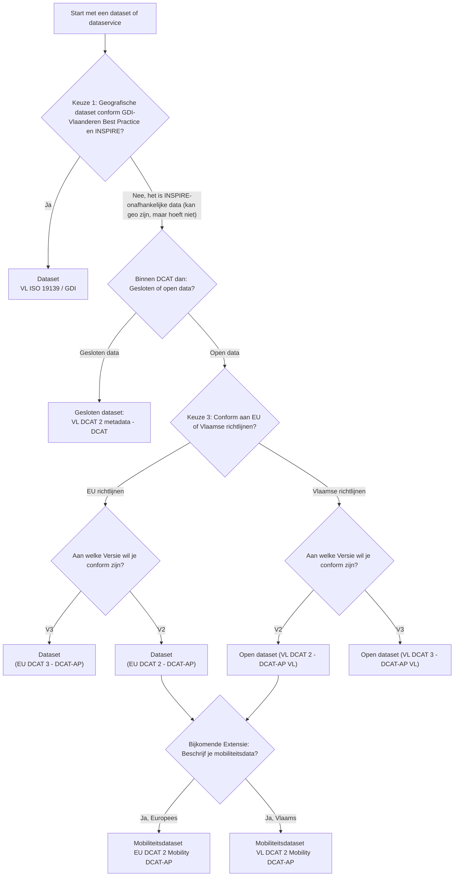

# FAQ

## De publicatie workflow 

## Standaarden en versies 

**Ik wil voor het eerst data beschrijven, waar moet ik beginnen?**

Een instapgids voor nieuwe gebruikers staat [hier](linkTODO ). In de meeste gevallen ga je inloggen als deel van een groep met een veilige authenticatie (zoals It's Me) en dan kan je een nieuwe record aanmaken met de meest geschikte sjabloon voor je doeleind.

**Welke sjabloon is juist voor mijn data?**
 Wij onderscheiden er tussen datasets en services (met dezelfde keuzes) en bijkomende categorieën zoals Objectencatalogi (omschrijving van attributen in datatabellen)en SubCatalogi (verzameling van metadatarecords binnen de Metadata Vlaanderen Catalog).

 Als je een Service of Dataset wilt omschrijven kan je de volgenden vragen beantwoorden: 

**Wat moet ik invullen om mijn data zichtbaar te maken op Datavindplaats**

***Ik zie meerdere secties met contactinformatie, wat moet ik waar invullen?***
Aan elk record kunnen meerdere rollen gekoppeld zijn met eigen contact informatie. Gebruik de glossary om de verschillen te verkennen en de juiste Organisatiegegevens in te vullen. Per definitie gaat de contactinformatie uit de sectie 'Gebruiksinformatie (voor DCAT-records) en de Meta-metadata (voor ISO records) op Datavindplaats onderaan getoond worden. Indien ingevuld, wordt daar ook de Eigenaar en de Uitgever apart getoond.

## Specifieke classificaties

**Hoe duidt ik aan dat mijn dataset een Hoogwaardige Dataset (HVD) is?**  
Dataset die onder Europese HVD-wetgeving valt en bijkomende metadata-elementen vereist zoals wetgeving en HVD-categorie. Beide informaties worden via een thesaurus wordt gekoppeld aan een record. 

## Licensies en rechten 

**Hoe duidt ik aan welke rechten de gebruikers op de omschreven datasets hebben?**
 

## Editing van de documentatie 

**Hoe link ik naar termen in de glossary?**

**Hoe link ik naar secties in de website?**
