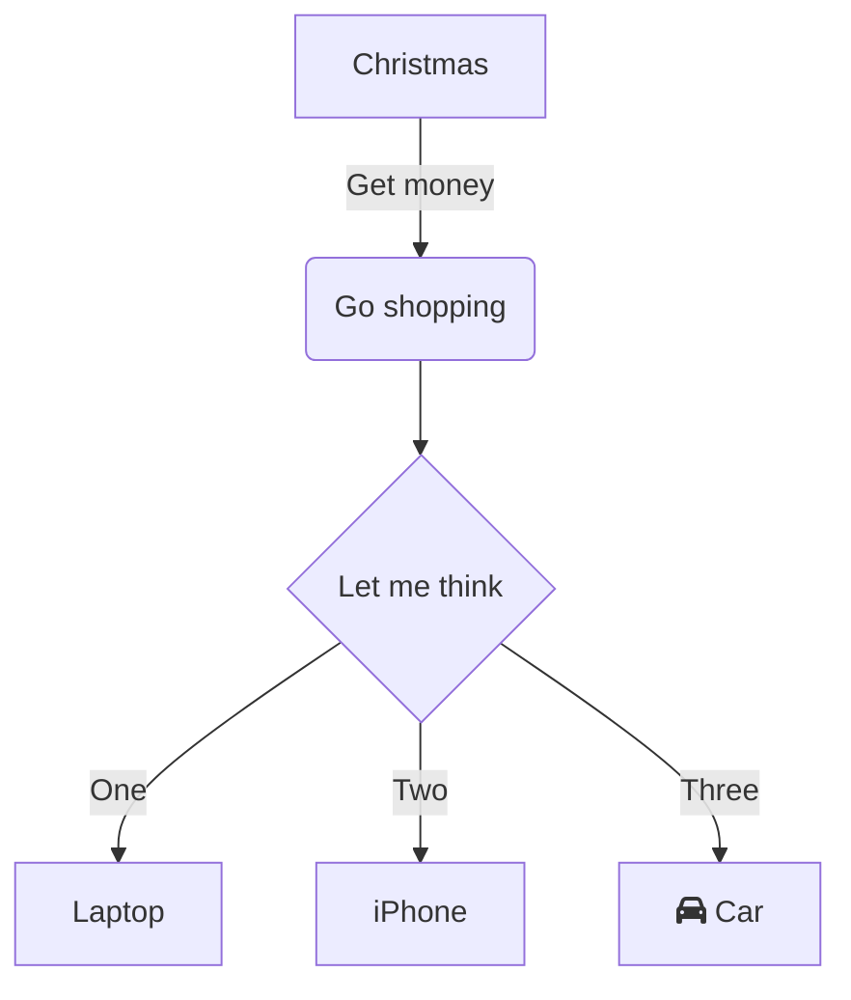

# Figures

## Render a local file (via code editor)
First, copy the image file into the assets folder (you can use a subfolder for more structure). Then, define an image link using ``.

## add a local image (in the github editor window)
drag and drop an image from your local pc to this editing platform -> it will be hosted by github. Mind copyrights.

## pasting a screenshot (in the github editor window)
! the default behaviour is to appear next to text, not below

# Sections

Render sections using hashtags `#`. These can be references using internal links to jump to the right section.

Examples: 
- jump to [Figures](#figures).
- jump to [Mermaid](#mermaid-section).

# Mermaid {#mermaid-section}

See lots of examples on [the live mermaid environment](https://mermaid.live). Below are some copied examples.

## Flowchart

# References

## 
