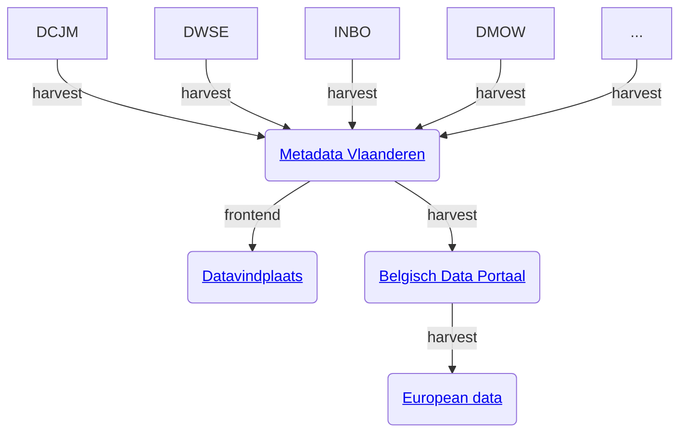

# Landschap

Metadata Vlaanderen participeert als Vlaamse bouwsteen in een gefedereerd internationaal landschap.

```mermaid
flowchart TD
    P1[DCJM] -->|harvest| MDV(<a href='https://metadata.vlaanderen.be'>Metadata Vlaanderen</a>)
    P2[DWSE] -->|harvest| MDV
    P3[INBO] -->|harvest| MDV
    P4[DMOW] -->|harvest| MDV
    P5[...] -->|harvest| MDV
    MDV --> |frontend| DVP(<a href='https://www.vlaanderen.be/datavindplaats'>Datavindplaats</a>)
    MDV --> |harvest| datagovbe(<a href='https://data.gov.be'>Belgisch Data Portaal</a>)
    datagovbe --> |harvest| dataeuropa(<a href='https://data.europa.eu'>European data</a>)
```