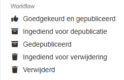

# Workflow status

# Publiek vs Privaat Gepubliceerd

## Instructie

## Versie 0.1

Publicatiedatum TBD

Auteur:

Datum aanmaak: 30 april 2026

Datum afdruk: 6 mei 2026

# Context

Dit document beschrijft hoe je gebruik kan maken van de nieuwe workflow-status “Privaat gepubliceerd”. Sinds [datum in te voegen] kan je gebruik maken van de status “Privaat gepubliceerd” in plaats van “Goedgekeurd en gepubliceerd” om een record te publiceren binnen een groep op Metadata Vlaanderen.

Voordien kon je een record publiek (zichtbaar voor iedereen) publiceren vanuit een groep via de status “Goedgekeurd en gepubliceerd”. Wanneer een record publiek gepubliceerd (“Goedgekeurd en gepubliceerd”) is in een groep, is het bewerkbaar voor de leden van de groep in kwestie en kan het gepubliceerd worden door de hoofdeditoren of administratoren. Editoren van een andere groep of publieke gebruikers (niet ingelogde gebruikers) kunnen het record bekijken, maar niet bewerken.

In bepaalde gevallen is het echter wenselijk dat een record gepubliceerd is voor intern gebruik, maar niet zichtbaar is voor het bredere publiek. In dit geval kan voortaan gekozen worden voor de workflowstatus “Privaat gepubliceerd” in plaats van “Goedgekeurd en gepubliceerd”. De status “Privaat gepubliceerd” zorgt er in dit geval voor dat het record zich gedraagt als een gepubliceerd record voor gebruikers die deel uit maken van de groep waarin het record “Privaat gepubliceerd” is, zonder dat het zichtbaar is voor gebruikers van andere groepen of publieke gebruikers.

De workflow status “Privaat gepubliceerd” kan gebruikt worden voor alle types records, i.e., dataset records, series en (sub)catalogi. Afhankelijk van het type record kan het gedrag verschillen zoals verder beschreven in dit document.

# Workflow

Als administator of hoofdeditor kan de workflow-status “Privaat gepubliceerd”, net zoals de status “Goedgekeurd en gepubliceerd”, worden toegewezen aan het record vanuit volgende statussen:

- “In ontwerp”: Wanneer je een nieuw aangemaakt draft record (niet publiek zichtbaar) onmiddellijk privaat wil publiceren.

- “Ingediend voor publicatie”: Wanneer je een nieuw aangemaakt draft record dat al ingediend is voor publicatie (niet publiek zichtbaar), privaat wil publiceren.

- “Klaar voor publicatie”: Wanneer je een nieuw aangemaakt draft record dat al gecontroleerd en klaar voor publicatie is (niet publiek zichtbaar), privaat wil publiceren.

- “Goedgekeurd en gepubliceerd”: Wanneer je een publiek gepubliceerd record privaat wil publiceren. Dit leidt ertoe dat het record enkel beschikbaar is voor leden van de groep waarin het record “Privaat gepubliceerd” is en het niet langer beschikbaar is voor het bredere publiek.

- “Gedepubliceerd”: Wanneer je een gedepubliceerd record (niet publiek zichtbaar) enkel beschikbaar wil maken voor de leden van de groep waarin het record gepubliceerd is zonder dat het record publiek beschikbaar wordt.

- “Ingediend voor verwijdering”: Wanneer je een record dat ingediend is voor verwijdering toch niet wil verwijderen maar privaat wil publiceren zodat het enkel zichtbaar is voor leden van de groep waarin het record gepubliceerd is. Let op, deze wijziging van workflowstatus wijkt af van de normale workflow en kan onwenselijk zijn.

Als administrator of hoofdeditor kan een record met de status “Privaat gepubliceerd” de volgende statussen toegewezen worden (zie Figuur 1):

- “In ontwerp”: Deze status kan enkel bereikt worden door het “Privaat gepubliceerd” record te bewerken. Er ontstaan hierdoor twee versies van het record. Het origineel “Privaat gepubliceerd” record blijft beschikbaar voor de leden van de groep waarin het gepubliceerd is, zonder dat het publiek beschikbaar is. Hiernaast ontstaat er een draftversie van het record waarin de aanpassingen worden bijgehouden. Deze draftversie heeft de status “In ontwerp”.

- “Goedgekeurd en gepubliceerd”: Wanneer je een “Privaat gepubliceerd” record, dat enkel zichtbaar is voor de leden van de groep waarin het gepubliceerd is, zichtbaar wil maken voor iedereen.

- “Ingediend voor depublicatie”: Wanneer je een “Privaat gepubliceerd” record wil indienen voor depublicatie. Een record met deze status blijft enkel zichtbaar voor de leden van de groep waarin het record gepubliceerd is.

- “Gedepubliceerd”: Wanneer je een “Privaat gepubliceerd” record wil depubliceren. Een record met deze status is enkel zichtbaar voor hoofdeditors en administators. Het is verder onzichtbaar voor iedereen, ongeacht de groep waarvan de gebruiker deel uitmaakt.

- “Ingediend voor verwijdering”: Wanneer je een “Privaat gepubliceerd” record wil indienen voor verwijdering. Een record met deze status blijft enkel zichtbaar voor de leden van de groep waarin het record gepubliceerd is.

- “Verwijderd”: Wanneer je een “Privaat gepubliceerd” record wil verwijderen. Let op, deze “status” is permanent en verwijdert alle informatie van het record waardoor niet meer teruggekeerd kan worden naar andere statussen. Alle informatie is permanent verloren.

/// figure-caption | #workflow
Workflow statussen die kunnen worden toegewezen aan een publiek of privaat gepubliceerd record.
///

# Zichtbaarheid

Verschillende soorten records kunnen worden aangemaakt op Metadata Vlaanderen. Alle records met de status “Goedgekeurd en gepubliceerd” zijn zichtbaar voor alle gebruikers van het platform, ongeacht van de groep waarvan ze deel uitmaken. Dit geldt ook voor publieke gebruikers.

Voor records met de status “Privaat gepubliceerd” moet er een onderscheid gemaakt worden tussen de verschillende types records. Afhankelijk van het type record, is het gedrag in combinatie met gerelateerde records verschillend. In deze sectie bespreken we het gedrag van records met de status “Privaat gepubliceerd” in detail.

## Dataset

Een dataset record is het eenvoudigste voorbeeld. Het record bestaat op zichzelf, zonder directe linken naar andere records. Hierdoor zijn er voor dataset records maar twee gevallen mogelijk:

- Een record met de status “Goedgekeurd en gepubliceerd” is publiek en zichtbaar voor alle gebruikers, ongeacht de groep waartoe ze horen.

- Een record met de status “Privaat gepubliceerd” is enkel zichtbaar voor leden van de groep waarin het record is gepubliceerd. Voor leden van andere groepen of voor publieke gebruikers is het privaat gepubliceerde record niet raadpleegbaar.

## Serie

Een serie van datasets is een verzameling van datasets met dezelfde specificaties. In praktijk kan een serie van dataset aangemaakt worden wanneer een reeks gelijkaardige datasets met verschillende versies door de tijd of ruimte gegroepeerd wenst te worden. Op het niveau van zichtbaarheid van de serie zijn er net zoals bij een dataset maar twee gevallen mogelijk:

- Een serie met de status “Goedgekeurd en gepubliceerd” is publiek en zichtbaar voor alle gebruikers, ongeacht de groep waartoe ze horen.

- Een serie met de status “Privaat gepubliceerd” is enkel zichtbaar voor leden van de groep waarin het record is gepubliceerd. Voor leden van andere groepen of voor publieke gebruikers is het privaat gepubliceerde record niet raadpleegbaar.

Er moet echter ook in rekening gebracht worden dat de records die de serie opmaken een verschillende status kunnen hebben. In praktijk zal er onderscheid kunnen gemaakt worden tussen series die bestaan uit:

- Alleen publiek gepubliceerde records

- Alleen privaat gepubliceerde records

- Een mix van publiek en privaat gepubliceerde records

Tabel 1 beschrijft de zichtbaarheid van alle mogelijk combinaties van gepubliceerde series en records.

### Tabel 1 Een overzicht van de zichtbaarheid voor verschillende gebruikers voor de combinatie van publieke en private series met publieke en private records.
|  | Publiek gepubliceerde serie | Privaat gepubliceerde serie |
| --- | --- | --- |
| Publiek gepubliceerde records | De serie en de records in de serie zijn zichtbaar voor alle gebruikers, ongeacht de groep waartoe ze horen. | De records zijn zichtbaar voor alle gebruikers, maar de serie is enkel zichtbaar voor gebruikers van de groep waartoe de serie behoort. |
| Privaat gepubliceerde records | Voor gebruikers die deel uitmaken van de groep waartoe de private records behoren, zijn de serie en de records in de serie zichtbaar. Voor gebruikers die niet deel uitmaken van de groep waarin de records zijn gepubliceerd, zal een lege serie publiek zichtbaar zijn. | De serie en de records in de serie zijn enkel zichtbaar voor gebruikers die deel uitmaken van de groep waarin de serie en de records zijn gepubliceerd. |
| Publiek en privaat gepubliceerde records | De serie is raadpleegbaar voor alle gebruikers, ongeacht de groep waartoe ze horen. De publieke records in de serie zijn zichtbaar voor alle gebruikers, ongeacht de groep waartoe ze behoren. De private records in de serie zijn enkel zichtbaar voor gebruikers die tot de groep behoren waarin de private records zijn gepubliceerd. | De serie is enkel zichtbaar voor gebruikers van de groep waarin de serie gepubliceerd is. De inhoud van serie bestaat voor gebruikers van de deze groep uit zowel publieke als private records. Gebruikers van andere groepen zullen enkel de publieke records kunnen raadplegen. |

## (Sub)catalogus

Een (sub)catalogus is een duidelijk afgebakende verzameling van metadatarecords die ervoor zorgt dat datasets beter doorzoekbaar worden. Enkele mogelijke manieren van groeperen zijn:

- Thema

- Regio/provincie

- Organisatie/dienst

Op het niveau van zichtbaarheid van de (sub)catalogus zijn er net zoals bij een dataset en een serie maar twee gevallen mogelijk:

- Een (sub)catalogus met de status “Goedgekeurd en gepubliceerd” is publiek en zichtbaar voor alle gebruikers, ongeacht de groep waartoe ze horen.

- Een (sub)catalogus met de status “Privaat gepubliceerd” is enkel zichtbaar voor leden van de groep waarin het record is gepubliceerd. Voor leden van andere groepen of voor publieke gebruikers is het privaat gepubliceerde record niet raadpleegbaar.

Er moet echter ook in rekening gebracht worden dat de records die de (sub)catalogus opmaken een verschillende status kunnen hebben. In praktijk zal er een onderscheid kunnen gemaakt worden tussen (sub)catalogi die bestaan uit:

- Alleen publiek gepubliceerde records

- Alleen privaat gepubliceerde records

- Een mix van publiek en privaat gepubliceerde records

Tabel 2 beschrijft de zichtbaarheid van alle mogelijke combinaties van gepubliceerde subcatalogi en records.

### Tabel 2 Een overzicht van de zichtbaarheid voor verschillende gebruikers voor de combinatie van publieke en private subcatalogi met publieke en private records.
|  | Publiek gepubliceerde (sub)catalogus | Privaat gepubliceerde (sub)catalogus |
| --- | --- | --- |
| Publiek gepubliceerde records | De subcatalogus en de records in de subcatalogus zijn zichtbaar voor alle gebruikers, ongeacht de groep waartoe ze horen. | De records zijn zichtbaar voor alle gebruikers, maar de subcatalogus is enkel zichtbaar voor gebruikers van de groep waartoe de subcatalogus behoort. |
| Privaat gepubliceerde records | Voor gebruikers die deel uitmaken van de groep waartoe de private records behoren, zijn de subcatalogus en de records in de subcatalogus zichtbaar. Voor gebruikers die niet deeluitmaken van de groep waarin de records zijn gepubliceerd, zal een lege subcatalogus publiek zichtbaar zijn. | De subcatalogus en de records in de subcatalogus zijn enkel zichtbaar voor gebruikers die deel uitmaken van de groep waarin de subcatalogus en de records zijn gepubliceerd. |
| Publiek en privaat gepubliceerde records | De subcatalogus is raadpleegbaar voor alle gebruikers, ongeacht de groep waartoe ze horen. De publieke records in de subcatalogus zijn zichtbaar voor alle gebruikers, ongeacht de groep waartoe ze behoren. De private records in de subcatalogus zijn enkel zichtbaar voor gebruikers die tot de groep behoren waarin de private records en de subcatalogus zijn gepubliceerd. | De subcatalogus is enkel zichtbaar voor gebruikers van de groep waarin de subcatalogus gepubliceerd is. De inhoud van de subcatalogus bestaat voor gebruikers van de deze groep uit zowel publieke als private records. Gebruikers van andere groepen zullen enkel de publieke records kunnen raadplegen zonder dat de private subcatalogus zichtbaar is. |