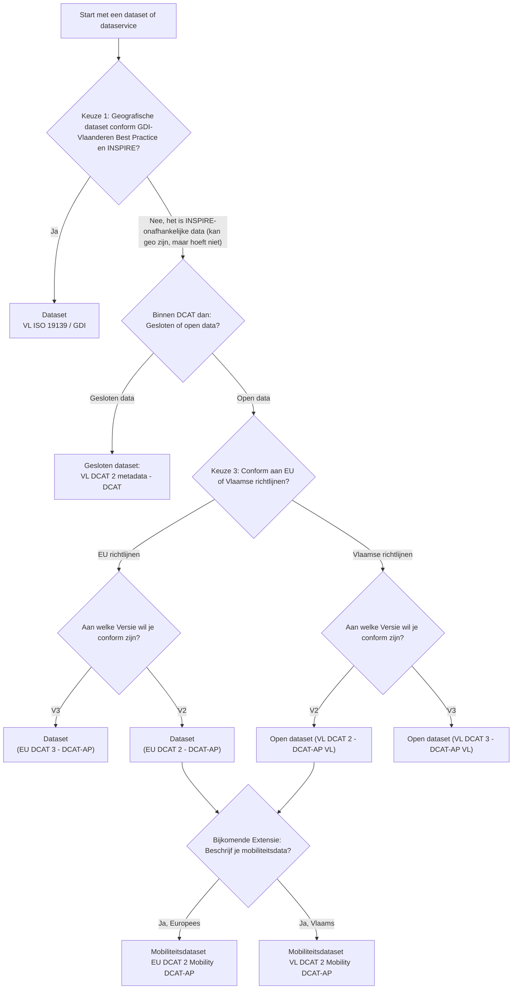

# Welke sjabloon is juist voor mijn data?

 Wij onderscheiden tussen datasets en services (met dezelfde keuzes) en bijkomende categorieën zoals objectencatalogi (omschrijving van attributen in datatabellen) en subcatalogi (verzameling van metadatarecords binnen de Metadata Vlaanderen catalogus).

 Als je een _service_ of _dataset_ wilt omschrijven kan je de volgende vragen beantwoorden: 

