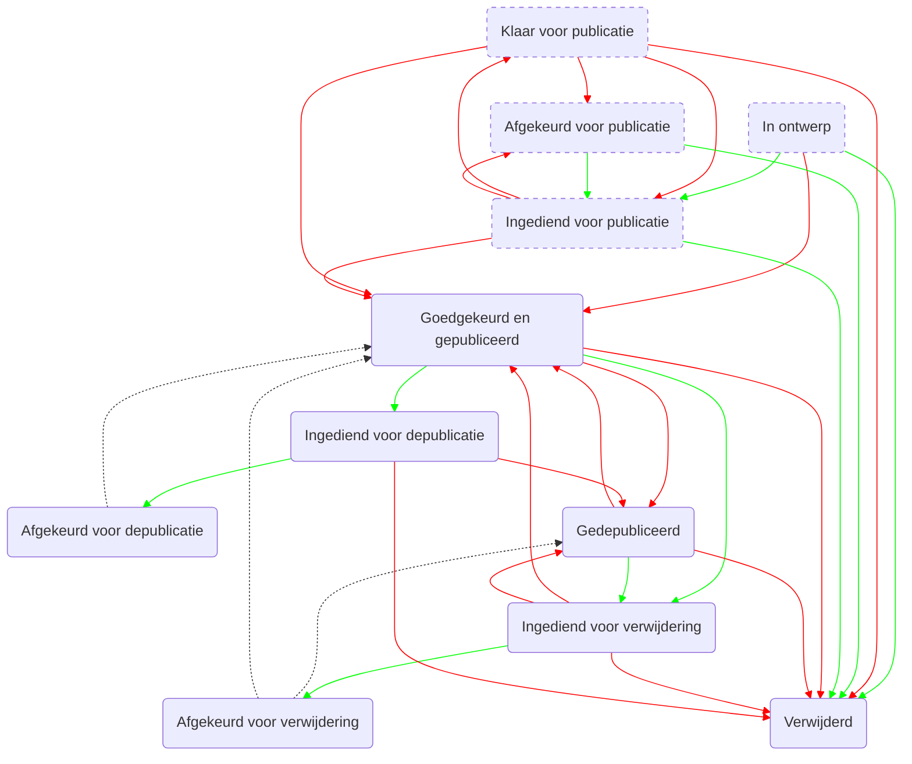

# Workflow

Een record krijgt na aanmaak een _workflow status_. Deze kan wijzigen doorheen de tijd, met als uiteindelijk doel _gepubliceerd_ te raken zodat het record zichtbaar wordt voor het publiek. Afhankelijk van de rol die je hebt binnen de applicatie (editor, reviewer, admin) kan je bepaalde aanpassingen aan de status doen. 

Dit werd origineel op [sharepoint](https://vlaamseoverheid.sharepoint.com/:x:/r/sites/aiv/Infocat/_layouts/15/Doc.aspx?sourcedoc=%7B180BC3B1-26C4-4280-9247-CA331DC812DD%7D&file=Flows%2Beditor%2Bhoofdeditor%2Ben%2BBeheerder_asis-tobe.xlsx&action=default&mobileredirect=true&DefaultItemOpen=1) beschreven.

## Flow

## Table

| Van                    | Naar                   | Enkel reviewer |
| ---------------------- | ---------------------- | -------------- |
| approved               | removed                | x              |
| approved               | retired                | x              |
| approved               | submitted_for_removed  |                |
| approved               | submitted_for_retired  |                |
| approved_for_published | approved               | x              |
| approved_for_published | rejected               | x              |
| approved_for_published | removed                | x              |
| approved_for_published | submitted              | x              |
| draft                  | approved               | x              |
| draft                  | approved_for_published | x              |
| draft                  | removed                |                |
| draft                  | submitted              |                |
| rejected               | removed                |                |
| rejected               | submitted              |                |
| retired                | submitted_for_removed  |                |
| retired                | approved               | x              |
| retired                | removed                | x              |
| submitted              | approved               | x              |
| submitted              | approved_for_published | x              |
| submitted              | rejected               | x              |
| submitted              | removed                |                |
| submitted_for_removed  | approved               | x              |
| submitted_for_removed  | rejected_for_removed   |                |
| submitted_for_removed  | removed                | x              |
| submitted_for_removed  | retired                | x              |
| submitted_for_retired  | removed                | x              |
| submitted_for_retired  | retired                | x              |
| submitted_for_retired  | rejected_for_retired   |                |

