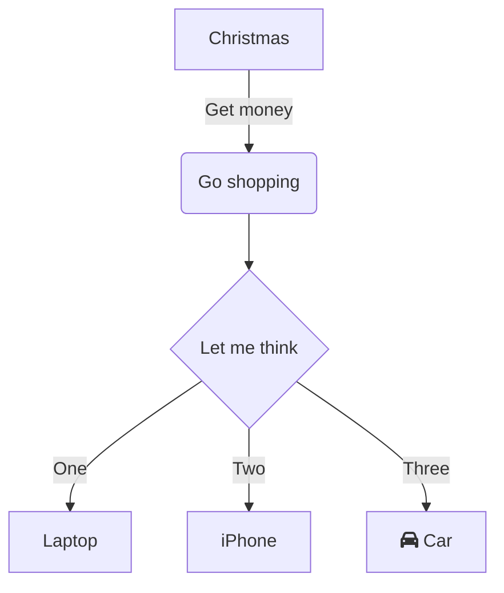

# Figures

## Render a local file
First, copy the image file into the assets folder (you can use a subfolder for more structure). Then, define an image link using ``.

# Sections

Render sections using hashtags `#`. These can be references using internal links to jump to the right section.

Example: jump to [Figures](#figures).

# Mermaid

See lots of examples on [the live mermaid environment](https://mermaid.live). Below are some copied examples.

## Flowchart

